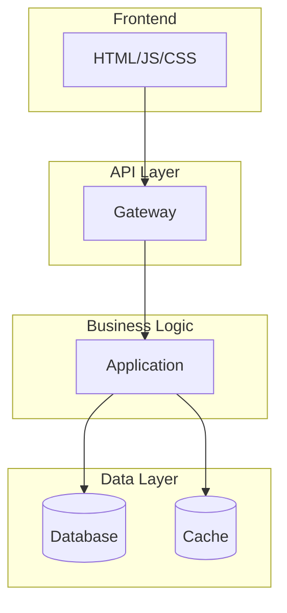

# 03_ARCHITECTURE

## System Overview

{PROJECT_NAME} is a {SYSTEM_TYPE} built using {PRIMARY_TECHNOLOGY}. The system handles [{BUSINESS_CAPABILITY_1}], [{BUSINESS_CAPABILITY_2}], and [{BUSINESS_CAPABILITY_3}].

### Architecture Diagram



## Frontend Architecture

### Technology Stack

- **Framework:** {FRONTEND_FRAMEWORK}
- **Build Tool:** {BUILD_TOOL}
- **Styling:** {STYLING_APPROACH}
- **State Management:** {STATE_MANAGEMENT}

### Page Structure

```
/frontend/
├── pages/
│   ├── {PAGE_1}.html
│   ├── {PAGE_2}.html
│   └── {PAGE_3}.html
├── js/
│   ├── modules/
│   └── entry-points/
└── css/
    ├── base/
    ├── components/
    └── utilities/
```

### Key Pages

| Page | Purpose | Primary JS Module |
|------|---------|-------------------|
| {PAGE_NAME_1} | {PAGE_PURPOSE_1} | {JS_MODULE_1} |
| {PAGE_NAME_2} | {PAGE_PURPOSE_2} | {JS_MODULE_2} |
| {PAGE_NAME_3} | {PAGE_PURPOSE_3} | {JS_MODULE_3} |

## Backend Architecture

### Technology Stack

- **Runtime:** {BACKEND_RUNTIME}
- **Framework:** {BACKEND_FRAMEWORK}
- **Database:** {DATABASE_TYPE}
- **Authentication:** {AUTH_METHOD}

### API Design

**Style:** {API_STYLE} (REST/GraphQL/gRPC)
**Versioning:** {VERSIONING_STRATEGY}
**Authentication:** {API_AUTH_METHOD}

### Endpoint Organization

```
/backend/
├── routes/
│   ├── {RESOURCE_1}.js
│   ├── {RESOURCE_2}.js
│   └── {RESOURCE_3}.js
├── middleware/
│   ├── auth.js
│   ├── error-handler.js
│   └── validation.js
├── services/
│   └── business-logic.js
└── utils/
    └── helpers.js
```

### API Surface Summary

| Resource | Methods | Auth Required | Rate Limit |
|----------|---------|---------------|------------|
| {RESOURCE} | {METHODS} | {YES_NO} | {LIMIT} |

## Database Architecture

### Schema Overview

**Type:** {DB_TYPE}
**Tables/Collections:** {TABLE_COUNT}
**Relationships:** {RELATIONSHIP_TYPE}

### Key Tables

```sql
-- Example table structure
{TABLE_EXAMPLE}
```

### Migrations

Location: `{MIGRATIONS_PATH}`
Naming: `{MIGRATION_NAMING_CONVENTION}`
Tool: {MIGRATION_TOOL}

## Deployment Topology

### Infrastructure

- **Hosting:** {HOSTING_PROVIDER}
- **CDN:** {CDN_PROVIDER}
- **DNS:** {DNS_PROVIDER}

### Environment Separation

```
Production → {PROD_URL}
Staging    → {STAGING_URL}
Development → {DEV_URL}
```

### CI/CD Pipeline


**Trigger:** {CI_TRIGGER}
**Build Time:** {BUILD_TIME}
**Deploy Time:** {DEPLOY_TIME}

## Security Architecture

### Authentication

- **Method:** {AUTH_METHOD}
- **Session Management:** {SESSION_MGMT}
- **Token Expiry:** {TOKEN_EXPIRY}

### Authorization

- **Model:** {AUTHZ_MODEL}
- **Role Definitions:** {ROLE_COUNT} roles

### Data Protection

- **Encryption at Rest:** {ENC_AT_REST}
- **Encryption in Transit:** {ENC_IN_TRANSIT}
- **Secrets Management:** {SECRETS_MGMT}

### Compliance

- **Standards:** {COMPLIANCE_STANDARDS}
- **Audit Logging:** {AUDIT_LOGGING}
- **Data Retention:** {DATA_RETENTION}

## Observability

### Logging

- **Aggregation:** {LOG_AGGREGATOR}
- **Retention:** {LOG_RETENTION}
- **Structured Logs:** {STRUCTURED_LOGS}

### Metrics

- **Collection:** {METRICS_COLLECTOR}
- **Dashboard:** {DASHBOARD_TOOL}
- **Alerts:** {ALERTING_SYSTEM}

### Tracing

- **Distributed Tracing:** {TRACING_ENABLED}
- **Tool:** {TRACING_TOOL}

## Integration Points

### External Services

| Service | Purpose | Integration Type |
|---------|---------|------------------|
| {SERVICE_1} | {PURPOSE_1} | {INTEGRATION_TYPE_1} |
| {SERVICE_2} | {PURPOSE_2} | {INTEGRATION_TYPE_2} |
| {SERVICE_3} | {PURPOSE_3} | {INTEGRATION_TYPE_3} |

### Webhooks

| Event | Destination | Retry Policy |
|-------|-------------|--------------|
| {EVENT_1} | {DESTINATION_1} | {RETRY_1} |
| {EVENT_2} | {DESTINATION_2} | {RETRY_2} |

---

*Replace all `{}` placeholders with your project-specific information. Delete unused sections.*
