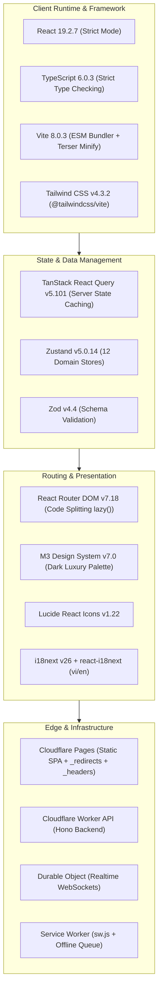
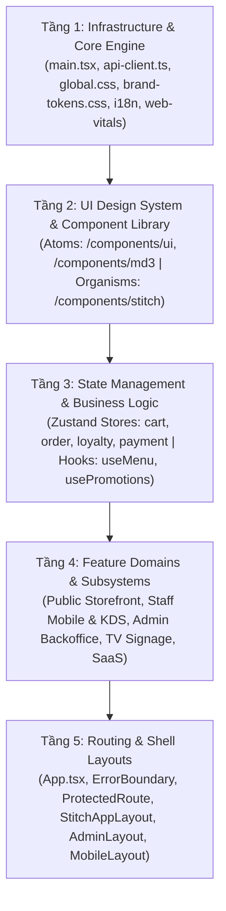
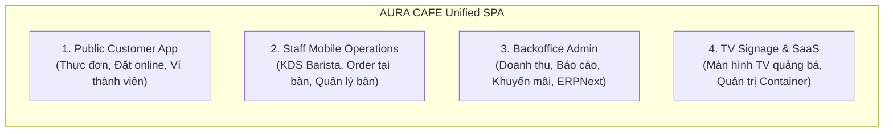
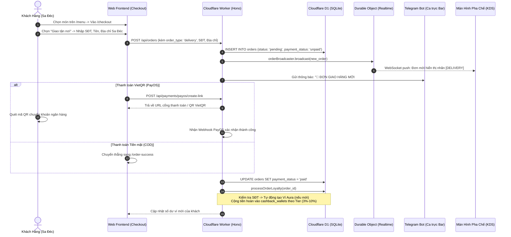

# Kiến Trúc Frontend Toàn Bộ Hệ Thống AURA CAFE (`FnB-Container-Caffe`)

Tài liệu này cung cấp bức tranh toàn cảnh về kiến trúc Frontend của website AURA CAFE (39 Nguyễn Tất Thành, Sa Đéc), đóng vai trò làm tài liệu kỹ thuật chuẩn (Technical Blueprint) để bạn tham khảo, tái cấu trúc (re-architect) hoặc mở rộng hệ thống.

---

## 1. Tổng Quan Ngăn Xếp Công Nghệ (Tech Stack)



### Thông số kỹ thuật cốt lõi:
- **Ngôn ngữ:** TypeScript 6.0 (Strict mode, ES2022 target).
- **Core Library:** React 19.2.7 với Concurrent Mode, Suspense, ErrorBoundary đa tầng.
- **Build Engine:** Vite 8.0.3 kết hợp Rollup manual chunks (`vendor-react`, `vendor-i18n`, `vendor-ui`, `vendor-query`) và Terser minifier.
- **Design System:** M3 Semantic Tokens v7.0 (Navy `#050D1A`, Bạc Kim `#C9D6DF`, Xanh Rừng `#2D5A3D`).
- **Data Fetching:** TanStack Query v5 (`staleTime: 30s`, `retry: 1`, tự động refetch theo lifecycle).
- **Client Stores:** Zustand v5 (Quản lý giỏ hàng, đơn hàng offline, ví hoàn tiền, phân quyền staff).

---

## 2. Sơ Đồ Phân Tầng Kiến Trúc (Architectural Layers)

Hệ thống được tổ chức thành **5 tầng kiến trúc độc lập (Separation of Concerns)**:



### Chi tiết từng tầng:

### Tầng 1: Infrastructure & Core Engine
- **Entry Point ([main.tsx](file:///Users/mac/mekong-cli/FnB-Container-Caffe/src/main.tsx)):** Khởi tạo `StrictMode`, `HelmetProvider`, Service Worker registration (`useSWRegistration`), cài đặt bộ đếm Web Vitals (`onLCP`, `onCLS`, `onINP`, `onTTFB`, `onFCP`) gửi beacon về `/api/vitals`.
- **API Client ([api-client.ts](file:///Users/mac/mekong-cli/FnB-Container-Caffe/src/lib/api-client.ts)):** Wrapper HTTP chuẩn trên nền `fetch`, tích hợp base URL (`import.meta.env.VITE_API_BASE`), đính kèm JWT Bearer token tự động, chuẩn hóa lỗi `ApiClientError`, và hỗ trợ interceptor xử lý lỗi toàn cục.
- **Design Tokens ([brand-tokens.css](file:///Users/mac/mekong-cli/FnB-Container-Caffe/src/styles/brand-tokens.css)):** Hệ thống biến CSS cấp độ nguyên tử định nghĩa toàn bộ màu sắc, độ bo góc, độ bóng đổ, font chữ và animation.

### Tầng 2: UI Design System & Component Library
Tuân thủ cấu trúc Atomic Design:
1. **Atoms ([src/components/ui/](file:///Users/mac/mekong-cli/FnB-Container-Caffe/src/components/ui)):**
   - `Button`: Hỗ trợ variant (primary, secondary, outline, ghost), trạng thái loading và disabled.
   - `Card`: Nền kính mờ (`backdrop-blur-md`), viền kim loại bạc, đổ bóng đa tầng.
   - `Badge`: Thẻ hiển thị hạng thẻ (Đồng, Bạc, Vàng, Bạch Kim) hoặc trạng thái đơn hàng.
   - `Skeleton`: Trạng thái shimmer loading chuẩn xác kích thước.
   - `Toast`: Hệ thống thông báo nổi (success, error, warning, info) qua `ToastProvider`.
2. **Molecules:**
   - Bộ đếm số lượng món, ô tìm kiếm món ăn, thẻ chọn mức đường/đá/topping.
3. **Organisms / Templates ([src/components/stitch/](file:///Users/mac/mekong-cli/FnB-Container-Caffe/src/components/stitch)):**
   - Các màn hình tích hợp hoàn chỉnh: `StitchCheckoutNew`, `StitchHeader`, `StitchLandingNew`, `KitchenDisplaySystem`.

### Tầng 3: State Management & Business Logic (Zustand & React Query)
Hệ thống phân tách rành mạch giữa **Server State** và **Client State**:

| State Domain | Công nghệ | File nguồn | Mô tả nghiệp vụ |
| :--- | :--- | :--- | :--- |
| **Menu & Danh mục** | React Query | [`use-menu.ts`](file:///Users/mac/mekong-cli/FnB-Container-Caffe/src/hooks/use-menu.ts) | Cache thực đơn 10 nhóm đồ uống, tự động đồng bộ khi quán cập nhật |
| **Giỏ hàng (Cart)** | Zustand | [`use-cart-store.ts`](file:///Users/mac/mekong-cli/FnB-Container-Caffe/src/hooks/stores/use-cart-store.ts) | Lưu trữ các món, phân loại biến thể (nóng/đá, size, topping), tính subtotal |
| **Đặt hàng & Offline** | Zustand | [`use-order-store.ts`](file:///Users/mac/mekong-cli/FnB-Container-Caffe/src/hooks/stores/use-order-store.ts) | Xử lý tạo đơn, hàng đợi offline IndexedDB, tự động đẩy đơn khi có mạng |
| **Thanh toán (Payment)** | Zustand | [`use-payment-store.ts`](file:///Users/mac/mekong-cli/FnB-Container-Caffe/src/hooks/stores/use-payment-store.ts) | Sinh link PayOS VietQR, cơ chế retry 3 lần, kiểm tra webhook thanh toán |
| **Ví Aura & Thành viên** | Zustand | [`use-loyalty-store.ts`](file:///Users/mac/mekong-cli/FnB-Container-Caffe/src/hooks/stores/use-loyalty-store.ts) | Quản lý 4 hạng thẻ, số dư ví hoàn tiền, lịch sử chi tiêu, tỷ lệ nhân điểm |
| **Xác thực (Auth)** | Zustand | [`use-auth-store.ts`](file:///Users/mac/mekong-cli/FnB-Container-Caffe/src/hooks/stores/use-auth-store.ts) | Lưu JWT session của Chủ quán / Barista / Phục vụ, kiểm tra quyền truy cập |

---

## 3. Bản Đồ Phân Hệ Ứng Dụng (Subsystem Taxonomy)

Toàn bộ ứng dụng phục vụ 4 nhóm người dùng trên cùng một Single Page Application (SPA):



### 1. Phân hệ Khách hàng (Public Customer App)
- **Trang chủ & Câu chuyện ([pages/home/](file:///Users/mac/mekong-cli/FnB-Container-Caffe/src/pages/home), [pages/stitch/our-story/](file:///Users/mac/mekong-cli/FnB-Container-Caffe/src/pages/stitch/our-story)):** Thiết kế phong cách kiến trúc Container, không gian cà phê tại Sa Đéc, hướng dẫn đường đi.
- **Thực đơn số ([pages/menu.tsx](file:///Users/mac/mekong-cli/FnB-Container-Caffe/src/pages/menu.tsx)):** Hiển thị 10 nhóm đồ uống đặc trưng Sa Đéc, lọc theo nhóm (Cà phê Việt, Trà hoa quả, Đá xay...), tùy biến đá/đường.
- **Thanh toán & Giao hàng ([pages/checkout.tsx](file:///Users/mac/mekong-cli/FnB-Container-Caffe/src/pages/checkout.tsx)):**
  - Hỗ trợ 3 phương thức nhận món: Giao tận nơi (Sa Đéc), Mang đi (Takeaway), Dùng tại bàn.
  - Tích hợp 3 cổng thanh toán: PayOS / VietQR động, Tiền mặt khi nhận (COD), Trừ trực tiếp Ví hoàn tiền Aura.
- **Theo dõi đơn hàng ([pages/stitch/track-order/](file:///Users/mac/mekong-cli/FnB-Container-Caffe/src/pages/stitch/track-order)):** Cập nhật tiến độ trực tiếp từ Barista (Tiếp nhận → Pha chế → Đang giao → Hoàn tất).
- **Hệ thống Thành viên ([pages/loyalty.tsx](file:///Users/mac/mekong-cli/FnB-Container-Caffe/src/pages/loyalty.tsx), [pages/promotions.tsx](file:///Users/mac/mekong-cli/FnB-Container-Caffe/src/pages/promotions.tsx)):**
  - Tra cứu ví hoàn tiền và số điểm qua Số điện thoại.
  - Hiển thị 4 bậc đặc quyền: Đồng (1.0x - 3%), Bạc (1.1x - 5%), Vàng (1.3x - 7%), Bạch Kim (1.5x - 10%).

### 2. Phân hệ Vận hành Ca trực Nhân viên (Staff Mobile & KDS)
- **Đăng nhập nhanh ([pages/mobile/mobile-login.tsx](file:///Users/mac/mekong-cli/FnB-Container-Caffe/src/pages/mobile/mobile-login.tsx)):** Đăng nhập mã PIN 4 số dành cho nhân viên ca trực.
- **Kitchen Display System ([pages/KDS.tsx](file:///Users/mac/mekong-cli/FnB-Container-Caffe/src/pages/KDS.tsx)):**
  - Nhận đơn thời gian thực qua WebSocket từ Cloudflare Durable Object.
  - Bắn âm thanh cảnh báo khi có đơn mới (`use-kds-audio.ts`).
  - Phân loại đơn: Nhãn đỏ cho `DELIVERY` (giao hàng Sa Đéc), nhãn xanh cho `TAKEAWAY`, nhãn vàng cho số bàn.
  - Chuyển trạng thái đơn: Chờ làm → Đang pha chế → Sẵn sàng phục vụ.
- **Quản lý bàn & Phục vụ ([pages/mobile/table-manager.tsx](file:///Users/mac/mekong-cli/FnB-Container-Caffe/src/pages/mobile/table-manager.tsx), [pages/mobile/waiter-orders.tsx](file:///Users/mac/mekong-cli/FnB-Container-Caffe/src/pages/mobile/waiter-orders.tsx)):**
  - Sơ đồ 12 bàn: Trạng thái Trống (Available), Đang có khách (Occupied), Cần dọn (Dirty).
  - Nhân viên bấm chọn bàn để tạo đơn tại chỗ.

### 3. Phân hệ Quản trị Doanh nghiệp (Backoffice Administration)
Bảo vệ bằng `ProtectedRoute` (`/admin/*`):
- **Bảng điều khiển & Doanh số ([pages/admin/Dashboard.tsx](file:///Users/mac/mekong-cli/FnB-Container-Caffe/src/pages/admin/Dashboard.tsx), [pages/admin/SalesReports.tsx](file:///Users/mac/mekong-cli/FnB-Container-Caffe/src/pages/admin/SalesReports.tsx)):**
  - Thống kê doanh thu theo ngày, tuần, tháng, giá trị trung bình đơn (AOV).
  - Tỷ lệ doanh thu giữa Giao hàng online vs Tại bàn.
- **POS Thu ngân quầy ([pages/admin/POS.tsx](file:///Users/mac/mekong-cli/FnB-Container-Caffe/src/pages/admin/POS.tsx)):**
  - Chốt đơn nhanh, in hóa đơn nhiệt qua máy in ESC/POS 58mm/80mm, tách hóa đơn, áp mã giảm giá `WELCOME`.
- **CRM & Quản lý Khách hàng ([pages/admin/Customers.tsx](file:///Users/mac/mekong-cli/FnB-Container-Caffe/src/pages/admin/Customers.tsx)):**
  - Xem danh sách thành viên, số dư ví cashback, lịch sử giao dịch, thăng hạng thủ công.
- **Cấu hình & Tích hợp ([pages/admin/ERPNExtSync.tsx](file:///Users/mac/mekong-cli/FnB-Container-Caffe/src/pages/admin/ERPNExtSync.tsx), [pages/admin/GenerateQR.tsx](file:///Users/mac/mekong-cli/FnB-Container-Caffe/src/pages/admin/GenerateQR.tsx)):**
  - Sinh tem QR code chuẩn cho từng bàn ăn.
  - Đồng bộ kế toán và tồn kho sang ERPNext.

### 4. Phân hệ Trình chiếu & TV Menu (Digital Signage)
- **TV Menu ([pages/TVMenu.tsx](file:///Users/mac/mekong-cli/FnB-Container-Caffe/src/pages/TVMenu.tsx)):** Màn hình lớn Full HD hiển thị bảng giá đồ uống, tự động cuộn trang và cập nhật trạng thái hết món theo thời gian thực.

---

## 4. Luồng Dữ Liệu & Tương Tác Trọng Yếu (Critical Data Flows)

### A. Luồng Đặt Hàng Online & Tích Lũy Ví Hoàn Tiền (Online Ordering & Cashback Flow)



---

## 5. Cấu Trúc Thư Mục Chuẩn Hiện Tại (Directory Structure)

```
FnB-Container-Caffe/
├── index.html                     # HTML Template, preconnect Google Fonts, PWA manifest
├── package.json                   # Dependencies: React 19, Vite 8, Tailwind 4, Zustand 5
├── vite.config.js                 # Rollup manualChunks, Terser minification, Cloudflare copy
├── _redirects                     # Cloudflare Pages SPA rewrite rule (/* /index.html 200)
├── _headers                       # Security headers (CSP, HSTS, X-Frame-Options)
├── public/                        # Static assets, favicon, sw.js, manifest.json
│   ├── sw.js                      # Service worker cho Public app
│   └── sw-mobile.js               # Service worker cho Staff mobile
└── src/
    ├── main.tsx                   # Khởi tạo React root, Helmet, Web Vitals, Service Worker
    ├── App.tsx                    # Shell layout, QueryClientProvider, AuthProvider, Router
    ├── routes/                    # 4 tệp định tuyến phân hệ tách biệt
    │   ├── public-routes.tsx      # Tuyến khách hàng (/menu, /checkout, /loyalty...)
    │   ├── mobile-routes.tsx      # Tuyến nhân viên (/mobile/login, /mobile/kds...)
    │   ├── admin-routes.tsx       # Tuyến quản trị (/admin/dashboard, /admin/pos...)
    │   └── stitch-routes.tsx      # Tuyến prototype thiết kế Stitch AI
    ├── styles/                    # Toàn bộ mã định kiểu CSS
    │   ├── global.css             # Tailwind v4 import & M3 utility classes
    │   └── brand-tokens.css       # Brand tokens v7.0 (Màu sắc, font, radius, motion)
    ├── hooks/                     # Custom hooks xử lý nghiệp vụ
    │   ├── stores/                # Zustand stores (12 domain stores)
    │   │   ├── use-cart-store.ts
    │   │   ├── use-order-store.ts
    │   │   ├── use-loyalty-store.ts
    │   │   ├── use-auth-store.ts
    │   │   └── use-payment-store.ts
    │   ├── use-menu.ts            # Tải thực đơn từ API
    │   ├── use-promotions.ts      # Kiểm tra mã giảm giá
    │   ├── use-kds.ts             # Quản lý WebSocket KDS
    │   └── use-online-status.ts   # Phát hiện online/offline
    ├── components/                # 32 thư mục thành phần giao diện
    │   ├── ui/                    # Design system cơ sở (Button, Card, Badge, Skeleton...)
    │   ├── stitch/                # Thành phần UI cao cấp (StitchCheckoutNew, StitchHeader...)
    │   ├── menu/                  # Lưới món ăn, bộ lọc danh mục
    │   ├── cart/                  # Giỏ hàng drawer, thanh tổng kết giỏ
    │   ├── order/                 # Form đặt hàng, thông tin giao hàng
    │   ├── kds/                   # Giao diện màn hình pha chế
    │   ├── loyalty/               # Thẻ bậc thành viên, thanh tiến trình hoàn tiền
    │   ├── pwa/                   # Banner offline, popup cài đặt PWA
    │   └── auth/                  # ProtectedRoute, AuthProvider
    ├── pages/                     # Các trang tính năng của hệ thống
    │   ├── home/                  # Trang chủ
    │   ├── menu.tsx               # Trang thực đơn trực tuyến
    │   ├── checkout.tsx           # Trang thanh toán & giao hàng
    │   ├── loyalty.tsx            # Trang khách hàng thân thiết
    │   ├── promotions.tsx         # Trang ưu đãi & mã giảm giá
    │   ├── KDS.tsx                # Trang KDS tại quầy
    │   ├── admin/                 # 25+ trang quản trị nội bộ
    │   └── mobile/                # Giao diện tối ưu cho điện thoại nhân viên
    └── lib/                       # Tiện ích bổ trợ (api-client, cn, validators, i18n)
```

---

## 6. Khuyến Nghị & Bản Thiết Kế Tái Cấu Trúc (Re-architecture Recommendations)

Nếu bạn có kế hoạch xây dựng lại hoặc tái cấu trúc (Re-architect) Frontend của hệ thống, dưới đây là các khuyến nghị then chốt từ góc độ kiến trúc sư phần mềm:

### 1. Phân Tách Mono-SPA thành Micro-Frontends hoặc App Workspaces (Monorepo)
*Hiện trạng:* Cả 4 phân hệ (Khách hàng, Nhân viên di động, Quản trị Backoffice, Màn hình TV) đang nằm chung 1 dự án SPA duy nhất. Dù đã dùng `React.lazy()`, bundle của Admin vẫn tải chung dependencies với Customer app.
*Khuyến nghị:* Dùng kiến trúc **pnpm workspaces** hoặc **Turborepo** để tách thành 3 package riêng:
- `apps/customer-web`: Ứng dụng khách hàng nhẹ, tối ưu SEO, tải dưới 1.5s trên 4G.
- `apps/staff-pos-kds`: Ứng dụng PWA chuyên biệt cho nhân viên, hỗ trợ full offline-first.
- `apps/admin-portal`: Ứng dụng quản trị backoffice, biểu đồ phân tích sâu.
- `packages/ui`: Thư viện Design System dùng chung.

### 2. Chuẩn Hóa Kiến Trúc Domain-Driven Component (Feature Folders)
*Hiện trạng:* Cấu trúc hiện tại tách riêng `src/components/`, `src/pages/`, `src/hooks/` theo loại tệp (Type-based). Khi mở rộng một tính năng (ví dụ `loyalty`), code bị rải rác ở nhiều thư mục.
*Khuyến nghị:* Chuyển sang mô hình **Feature-sliced / Domain-driven**:
```
src/features/
├── ordering/           # Gồm components, hooks, api, types, pages riêng của Đặt hàng
├── loyalty-cashback/   # Gồm components, hooks, api, types của Thành viên & Ví
├── kds-kitchen/        # Gồm WebSocket handler, audio, UI của Màn hình pha chế
└── admin-sales/        # Gồm biểu đồ, bảng dữ liệu, bộ lọc báo cáo
```

### 3. Tối Ưu Hóa Giao Diện Đặt Hàng Không Cần Đăng Ký (Guest Checkout with Smart Linking)
*Chiến lược:* Khách hàng F&B tại Việt Nam rất ngại tạo tài khoản rườm rà. Hệ thống Frontend mới nên duy trì nguyên tắc **"Zero-Friction Checkout"**:
- Khách chỉ cần nhập **Số Điện Thoại** để đặt hàng.
- Frontend tự động gọi API `/api/loyalty/lookup?phone=...` qua cơ chế debounce 400ms:
  - Nếu đã là thành viên: Hiển thị lời chào cá nhân hóa, huy hiệu hạng thẻ, và gợi ý cấn trừ số dư ví hoàn tiền.
  - Nếu là khách mới: Tự động ghi nhận đơn và hiển thị thông báo quà chào mừng thành viên mới sau khi thanh toán.

### 4. Kết Nối Trực Tiếp Hạ Tầng Cloudflare Edge
- Khai thác tối đa **Cloudflare Workers Assets** hoặc **Cloudflare Pages Functions** để cache SSR/Edge Cache danh mục thực đơn, giảm thời gian TTFB xuống dưới 50ms cho khách hàng tại Việt Nam.
