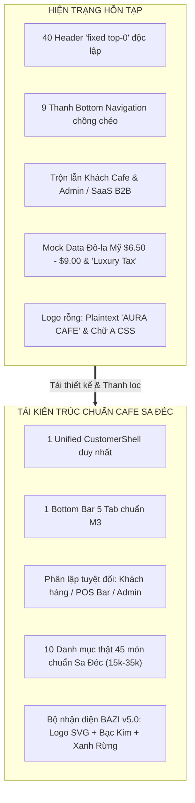
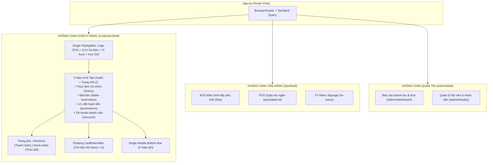

# BÁO CÁO KIỂM TRA CHUYÊN SÂU UI/UX & BẢN THIẾT KẾ TÁI KIẾN TRÚC FRONTEND
## AURA CAFE — CONTAINER CAFFE & SPACE SA ĐÉC (`FnB-Container-Caffe`)

> **Mã báo cáo:** `AUDIT-FE-UIUX-20260921`  
> **Phạm vi kiểm tra:** Toàn bộ Frontend SPA (`src/App.tsx`, `src/routes/`, `src/components/`, `src/pages/`, `src/styles/`, `src/locales/`)  
> **Phương pháp:** Audit tĩnh mã nguồn, đối chiếu Git lịch sử tháng 5–6/2026 (BAZI v5.0/v5.1, Menu 10 nhóm 45 món, Brand Assets), kiểm tra đụng độ layout DOM runtime.

---

## 1. TỔNG QUAN ĐÁNH GIÁ & CÁC CON SỐ BIẾT NÓI

Qua quá trình deep-check toàn diện mã nguồn giao diện, hệ thống Frontend hiện tại đang rơi vào tình trạng **"khủng hoảng phân mảnh" (Sprawl & Fragmentation)** do việc chắp vá các màn hình thiết kế mẫu Stitch AI mà không qua chuẩn hóa kiến trúc.



### Các chỉ số bất thường được phát hiện:
* **40 component header** khai báo `fixed top-0 w-full z-50` độc lập thay vì kế thừa từ Layout cha.
* **9 file `bottom-nav.tsx` riêng biệt** nằm rải rác trong từng thư mục trang con, khiến màn hình mobile xuất hiện **2 đến 3 thanh điều hướng chồng lên nhau**.
* **4 đường dẫn Menu cạnh tranh** (`/menu`, `/order`, `/stitch/digital-menu-1`, `/stitch/digital-menu-2`).
* **0 logo thương hiệu thực sự hiển thị** trên thanh điều hướng người dùng (toàn bộ hiển thị chữ thô `<div>AURA CAFE</div>` hoặc vòng tròn chứa chữ "A" vẽ bằng CSS).
* **6 món ăn giả định giá bằng USD** (`Midnight Espresso $6.50`, `Chrome Velvet Latte $8.00`, `Ceremonial Matcha $7.50`...) nằm trong component Menu chính, đè bẹp menu 45 món truyền thống của Sa Đéc.
* **Hàng loạt thuật ngữ Anh - Việt lai căng**: *"Nocturnal Crafts"* (thay vì Món đã chọn), *"Luxury Tax"* (quán cafe bình dân mà áp thuế xa xỉ!), *"The Digital Reserve"*, *"Julian Vane"*, *"128 Obsidian Plaza"*.

---

## 2. ĐỐI CHIẾU LỊCH SỬ THIẾT KẾ THÁNG 5 & 6/2026 (BAZI FOUNDATION)

Dữ liệu lịch sử từ các commit tháng 5 và 6/2026 (`a43eb83`, `0bd9cdb`, `0a30d1b`, `62ac5dd`) và tài liệu kiến trúc [[ADR-0006](file:///Users/mac/mekong-cli/FnB-Container-Caffe/docs/06_ADR/0006-bazi-design-system-v5-1.md)], [[pencil-bazi-adjustment-prompts.md](file:///Users/mac/mekong-cli/FnB-Container-Caffe/designs/pencil-bazi-adjustment-prompts.md)] định hình rõ bản sắc nguyên bản của dự án:

### 2.1. Triết Lý Bát Tự & Bảng Màu Thương Hiệu (Bazi v5.0 / v5.1)
* **Chủ quán:** Nguyễn Hữu Còn — Mệnh **Nhâm Thủy (壬 Thủy Dương)**, đại vận Hỏa (2020–2029).
* **Pha chế chính:** Nguyễn Văn Tú — Mệnh **Ất Mộc (乙 Mộc)**.
* **Quy luật tương sinh:** **Kim sinh Thủy · Thủy sinh Mộc**.
* **Bảng màu cốt lõi chuẩn BAZI:**
  1. **Thủy (Primary & Surfaces):** Vực Thẳm (`#050D1A`), Đêm Biển (`#0A1A2E`), Đại Dương (`#142A4A`).
  2. **Kim (Accent & Trim - Kim sinh Thủy):** Bạc Kim (`#C9D6DF`), Chrome Sáng (`#E8EEF3`), Thép Chrome (`#6B9FB8`).
  3. **Mộc (Bar & Nature - Thủy sinh Mộc):** Rừng Sâu (`#1A2D1F`), Xanh Rừng Forest (`#2D5A3D`), Sương Mai (`#A8C5A0`).
* **MÀU BỊ NGHIÊM CẤM (STRICTLY BANNED):**
  * ❌ **Vàng Gold (`#D4AF37`, `#FFD700`):** Thổ khắc Thủy — commit `a43eb83` đã loại bỏ hoàn toàn Gold để chuyển sang Bạc Chrome. Hiện nay mã `#D4AF37` đang bị lọt trở lại trong [`aura-tokens.css:L25`](file:///Users/mac/mekong-cli/FnB-Container-Caffe/src/styles/aura-tokens.css#L25) dưới tên "Bronze".
  * ❌ **Nâu Đất (`#8B4513`):** Thổ khắc Thủy.
  * ❌ **Đỏ Cam rực (`#FF6B35`):** Hỏa quá vượng, gây hao tán năng lượng Thủy.

### 2.2. Tài Nguyên Logo Chính Thức Đã Có Sẵn (Official Assets)
Dự án đã sở hữu đầy đủ bộ nhận diện hình ảnh chất lượng cao nhưng chưa được tích hợp vào code:
1. [`public/images/logo.svg`](file:///Users/mac/mekong-cli/FnB-Container-Caffe/public/images/logo.svg): Logo Vector chuẩn (Chữ lồng Monogram A-emblem màu bạc trên nền navy tròn).
2. [`public/images/logo-aura-rgb.png`](file:///Users/mac/mekong-cli/FnB-Container-Caffe/public/images/logo-aura-rgb.png) & `.webp`: Logo phối màu chuẩn RGB v8.1 BAZI chống viền vuông.
3. [`public/images/aura-space-logo-v2f.png`](file:///Users/mac/mekong-cli/FnB-Container-Caffe/public/images/aura-space-logo-v2f.png): Logo không gian Container & Caffe.
4. [`assets/brand/fnb_water_logo.png`](file:///Users/mac/mekong-cli/FnB-Container-Caffe/assets/brand/fnb_water_logo.png): Water drop logo tương sinh Bát Tự.

### 2.3. Thực Đơn Chuẩn 10 Nhóm 45 Món (Sa Đéc Authentic Menu)
Tập tin [`data/menu-data.json`](file:///Users/mac/mekong-cli/FnB-Container-Caffe/data/menu-data.json) lưu trữ trọn vẹn danh mục đồ uống thực tế với giá từ 10.000₫ – 35.000₫:
1. `traditional-coffee`: Cà phê phin/máy (20k), Cà phê sữa (25k), Cà phê muối (28k), Bạc xỉu (28k), Ca cao sữa (30k)...
2. `hot-coffee`: Espresso (20k), Americano (25k), Cappuccino (35k), Mocha (35k), Latte (35k)...
3. `frappuccino`: Cà phê đá xay (35k), Cookie Frappu (35k), Cà phê Dừa Việt quất (35k)...
4. `soda`: Soda Ý Sapphire (25k), Emerald (25k).
5. `tea`: Trà đào (30k), Trà mãng cầu (29k), Lipton chanh/sữa/cam (18k - 25k), Trà cúc (29k).
6. `smoothies`: Sinh tố bơ (35k), Sinh tố dâu (35k), Sinh tố mãng cầu (35k), Sinh tố sapo (35k).
7. `yogurt`: Yaourt đá (20k), Yaourt cà phê (23k), Yaourt hủ (15k).
8. `juice`: Cam vắt (23k), Rau má dừa (25k), Dừa trái (23k), Đá chanh (18k).
9. `other-drinks`: Trà đường (18k), Đá me (18k), Chanh muối (18k), Sữa tươi (20k).
10. `bottled`: Nước suối (10k), Nước ngọt Sting/Coke/Pepsi (15k), Redbull (20k).

---

## 3. PHÂN TÍCH CHI TIẾT 4 LỖ HỔNG LỚN CỦA GIAO DIỆN HIỆN TẠI

### Vấn Đề 1: Đụng Độ Shell, Trùng Lặp Header & Bottom Navigation
* **Thực trạng mã nguồn:**
  * Tại [`src/components/stitch/CustomerShell.tsx:L20-L29`](file:///Users/mac/mekong-cli/FnB-Container-Caffe/src/components/stitch/CustomerShell.tsx#L20-L29), trang web được bọc bởi `<MD3AppShell>`, tự động render `<MD3TopAppBar>` và `<MD3NavigationBar>` (5 tab chính) cùng thanh `<CartBottomBar />`.
  * Tuy nhiên, các trang con được lazy load bên trong lại **tự render Header và Bottom Bar riêng của chúng**:
    * Trang Checkout ([`StitchCheckoutNew.tsx:L145`](file:///Users/mac/mekong-cli/FnB-Container-Caffe/src/components/stitch/StitchCheckoutNew.tsx#L145)) tự render một `<header className="fixed top-0 left-0 w-full z-50">` và một `<footer className="fixed bottom-0 left-0 w-full z-50">`. Khi kết hợp với `<MD3TopAppBar>` từ Shell, người dùng thấy **2 thanh header đè lên nhau**.
    * Trang Đặt bàn ([`src/pages/stitch/reservation-new/bottom-nav.tsx`](file:///Users/mac/mekong-cli/FnB-Container-Caffe/src/pages/stitch/reservation-new/bottom-nav.tsx)) tự render thanh đáy với 3 nút (`Menu`, `Reservations`, `Profile`). Thanh này đè bẹp thanh 5 nút của Shell cha!
    * Trang Ưu đãi ([`src/pages/stitch/promotions-new/bottom-nav.tsx`](file:///Users/mac/mekong-cli/FnB-Container-Caffe/src/pages/stitch/promotions-new/bottom-nav.tsx)) cũng tự render một thanh đáy hình bán nguyệt riêng với các đường dẫn ảo `href="#"`.
    * Tương tự với trang Tài khoản ([`StitchAccountNew-bottom-nav.tsx`](file:///Users/mac/mekong-cli/FnB-Container-Caffe/src/components/stitch/StitchAccountNew-bottom-nav.tsx)), Check-in ([`StitchCheckinNew-bottom-nav.tsx`](file:///Users/mac/mekong-cli/FnB-Container-Caffe/src/components/stitch/StitchCheckinNew-bottom-nav.tsx)), Lịch sử đơn ([`StitchTrackOrderNew-bottom-nav.tsx`](file:///Users/mac/mekong-cli/FnB-Container-Caffe/src/components/stitch/StitchTrackOrderNew-bottom-nav.tsx)).
* **Hậu quả UX:** Trên điện thoại, màn hình bị chiếm dụng đến hơn 40% diện tích cho các thanh điều hướng chồng chéo, chặn đứng thao tác cuộn và che mất nút bấm của giỏ hàng.

### Vấn Đề 2: Kiến Trúc Luồng Nghiệp Vụ Khách Cafe Bị Đảo Lộn
* **Lẫn lộn đối tượng sử dụng:**
  * Trong danh sách route của khách hàng tại [`src/routes/public-routes.tsx:L78-L81`](file:///Users/mac/mekong-cli/FnB-Container-Caffe/src/routes/public-routes.tsx#L78-L81), tồn tại các trang SaaS B2B: `/pricing`, `/saas/dashboard`, `/saas/onboard/tenant`. Khách uống cafe quét mã QR tại bàn tuyệt đối không được nhìn thấy các trang quản trị SaaS này!
* **Phân mảnh trang Thực đơn & Đặt món:**
  * Khách truy cập `/menu` thì gặp giao diện Stitch nén 10 nhóm món thành 4 nhóm cụt lủn ([`src/pages/menu.tsx:L14-L30`](file:///Users/mac/mekong-cli/FnB-Container-Caffe/src/pages/menu.tsx#L14-L30)), trong khi truy cập `/order` lại sang trang POS gọi món tại bàn [`TableOrder.tsx`](file:///Users/mac/mekong-cli/FnB-Container-Caffe/src/pages/TableOrder.tsx).
* **Thiếu luồng chọn món F&B tiêu chuẩn:**
  * Quán cafe bắt buộc phải có modal tùy chọn nhanh (Modifier Modal): Chọn Size (Vừa / Lớn), Mức đường (100% / 70% / 50% / 0%), Mức đá (100% / 50% / Nóng), Thêm Topping (Trân châu trắng, Thạch củ năng, Kem cheese...). Hệ thống hiện tại chỉ đưa thẳng món vào giỏ hàng mà không cho chọn các biến thể này một cách mạch lạc.

### Vấn Đề 3: Ngôn Từ Anh - Việt Lẫn Lộn (Chinglish & Mock Data Xa Lạ)
* Hệ thống hiện tại đang sử dụng các chuỗi tiếng Anh mặc định làm fallback thay vì tiếng Việt tự nhiên:

| Thành phần | Chuỗi hiện tại trong mã nguồn | Vấn đề | Đề xuất chuẩn hóa tiếng Việt F&B |
| :--- | :--- | :--- | :--- |
| **Tiêu đề Menu** | `The Digital Reserve` ([`StitchMenuNew.tsx:L49`](file:///Users/mac/mekong-cli/FnB-Container-Caffe/src/components/stitch/StitchMenuNew.tsx#L49)) | Nghe như ngân hàng tiền số, xa lạ với quán cafe | **Thực Đơn Đồ Uống** |
| **Mô tả Menu** | `Industrial precision meets high-end hospitality...` | Tiếng Anh hàn lâm | **Cà phê container độc bản giữa lòng Sa Đéc** |
| **Nút Header** | `Order Now`, `Reservation`, `Location` ([`StitchLandingNew-nav.tsx`](file:///Users/mac/mekong-cli/FnB-Container-Caffe/src/components/stitch/StitchLandingNew-nav.tsx)) | Nửa Anh nửa Việt | **Gọi món ngay**, **Đặt bàn**, **Không gian quán** |
| **Thanh toán** | `Finalize Selection` ([`StitchCheckoutNew.tsx:L159`](file:///Users/mac/mekong-cli/FnB-Container-Caffe/src/components/stitch/StitchCheckoutNew.tsx#L159)) | Thuật ngữ phần mềm B2B | **Xác Nhận Đơn Hàng & Thanh Toán** |
| **Món đã chọn** | `Nocturnal Crafts` ([`StitchCheckoutNew-footer.tsx:L37`](file:///Users/mac/mekong-cli/FnB-Container-Caffe/src/components/stitch/StitchCheckoutNew-footer.tsx#L37)) | "Thủ công ban đêm" không có nghĩa trong F&B | **món đã chọn** |
| **Phụ phí** | `Luxury Tax` ([`checkout.tsx:L63`](file:///Users/mac/mekong-cli/FnB-Container-Caffe/src/pages/checkout.tsx#L63)) | Phí xa xỉ (sai bản chất cafe bình dân) | **Phí dịch vụ / Miễn phí phục vụ** |
| **Dữ liệu giả** | `Julian Vane`, `128 Obsidian Plaza`, `$6.50` | Copy & paste từ template nước ngoài | Họ tên khách Việt, địa chỉ tại Sa Đéc, giá VNĐ |

### Vấn Đề 4: Hoàn Toàn Vắng Bóng Logo Thương Hiệu
* **Thanh Header:** Trên tất cả các màn hình, vị trí logo chỉ là một chuỗi văn bản HTML thuần túy:
  ```tsx
  // src/components/stitch/StitchLandingNew-nav.tsx:L21
  <div style={{ fontFamily: "var(--aura-font-display)", fontSize: '32px' }}>
    AURA CAFE
  </div>
  ```
* **Hero Banner:** Tại [`src/components/home/hero-section.tsx:L120-L128`](file:///Users/mac/mekong-cli/FnB-Container-Caffe/src/components/home/hero-section.tsx#L120-L128), logo được render bằng một thẻ `div` tròn chứa ký tự chữ **"A"** viết in hoa:
  ```tsx
  <div className="flex h-full w-full items-center justify-center rounded-full bg-[#0A1A2E] text-4xl font-bold text-chrome-bright">
    A
  </div>
  ```
* Khách hàng vào website không hề thấy biểu tượng nhận diện đặc trưng (Monogram Bạc Kim trên nền giọt nước Thủy) vốn đã được thiết kế rất công phu từ tháng 5/2026.

---

## 4. BẢN THIẾT KẾ TÁI KIẾN TRÚC FRONTEND (TO-BE ARCHITECTURE)

Để giải quyết triệt để sự hỗn tạp, kiến trúc Frontend mới sẽ được tổ chức lại theo nguyên tắc: **Một Shell duy nhất cho khách hàng — Phân định ranh giới rõ ràng — Thuần Việt 100% — Tôn vinh Bát Tự & Logo chính thức**.



### 4.1. Quy Chuẩn Shell Khách Hàng (Unified CustomerShell)
1. **Xóa bỏ toàn bộ 9 thanh `bottom-nav.tsx` riêng lẻ** trong các thư mục con. Chỉ giữ lại thanh điều hướng duy nhất tại `MD3NavigationBar` của `CustomerShell`.
2. **Loại bỏ thẻ `<header>` cố định trong các trang con**:
   - `StitchLandingNew`, `StitchCheckoutNew`, `StitchMenuNew`, `ReservationNew`, `PromotionsNew`... sẽ **không tự tạo header**.
   - Mọi tiêu đề trang, nút back, avatar tài khoản và biểu tượng giỏ hàng sẽ được cấu hình tập trung thông qua [`shell-config.ts`](file:///Users/mac/mekong-cli/FnB-Container-Caffe/src/components/stitch/shell-config.ts).
3. **Độ ưu tiên hiển thị thanh đáy (Z-Index & Collision Management):**
   - Trên các trang Tab: Hiển thị `BottomNavigationBar` (chiều cao 64px + safe-area).
   - Khi có món trong giỏ: `<CartBottomBar />` tự động trượt lên nổi **ngay phía trên** thanh điều hướng (`bottom-[72px]`), đảm bảo cả 2 thanh đều bấm được, không che lấp nhau.
   - Khi ở trang `/checkout`: Tự động ẩn thanh BottomNavigationBar, `<CartBottomBar />` cũng ẩn đi; trang thanh toán chiếm trọn chiều cao màn hình với nút hành động cố định duy nhất ở đáy màn hình.

### 4.2. Tích Hợp Logo & Khóa Nhận Diện Thương Hiệu (Brand Lockup)
Cấu trúc chuẩn của Header khách hàng:
```tsx
<div className="flex items-center gap-3">
  {/* Logo SVG chính thức */}
  <Link to="/" className="flex items-center gap-2.5 group">
    
    <div className="flex flex-col">
      <span className="font-['Cormorant_Garamond'] text-xl font-bold tracking-wider text-[#C9D6DF]">
        AURA CAFE
      </span>
      <span className="text-[10px] uppercase tracking-widest text-[#4A7C59] font-semibold -mt-1">
        Sa Đéc · Container Space
      </span>
    </div>
  </Link>
</div>
```

### 4.3. Kiến Trúc Trang Thực Đơn (10 Nhóm Món Chuẩn F&B)
* Đọc trực tiếp từ nguồn dữ liệu chuẩn [`data/menu-data.json`](file:///Users/mac/mekong-cli/FnB-Container-Caffe/data/menu-data.json), không qua hàm `CATEGORY_MAP` rút gọn ép buộc.
* Phân loại thành 10 tab lướt ngang (Horizontal Chip Bar):
  1. ☕ Cà phê truyền thống
  2. 🔥 Cà phê nóng
  3. 🧊 Đá xay đặc biệt
  4. 🫧 Soda kiểu Ý
  5. 🍵 Trà & Thảo mộc
  6. 🥤 Sinh tố trái cây
  7. 🥛 Yaourt
  8. 🍊 Nước ép tươi
  9. 🥤 Thức uống khác
  10. 🧴 Đồ đóng chai
* Mỗi thẻ món ăn:
  - Hiển thị ảnh chụp không gian/món thực tế.
  - Tên tiếng Việt nổi bật, phụ đề tiếng Anh nhỏ bên dưới.
  - Giá niêm yết rõ ràng bằng VNĐ (VD: `25.000₫`).
  - Nút thêm nhanh (`+`) mở **Modal tùy chọn (Size, Đường, Đá)**.

### 4.4. Từ Điển F&B Chuẩn Hóa (100% Thuần Việt)
Cập nhật file từ điển `src/locales/vi.json` làm ngôn ngữ chính:
* `checkout.title`: *"Xác nhận đơn hàng"*
* `checkout.orderType.delivery`: *"Giao tận nơi (TP. Sa Đéc)"*
* `checkout.orderType.takeaway`: *"Mang đi (Lấy tại quầy bar AURA)"*
* `checkout.orderType.dineIn`: *"Dùng tại quán (Theo số bàn)"*
* `checkout.paymentMethod.payos`: *"Chuyển khoản VietQR (Tự động xác nhận)"*
* `checkout.paymentMethod.cash`: *"Tiền mặt (Thanh toán tại quầy)"*
* `loyalty.tier.dong`: *"Hạng Đồng (Hoàn tiền 1.0x)"*
* `loyalty.tier.bac`: *"Hạng Bạc (Hoàn tiền 1.1x)"*
* `loyalty.tier.vang`: *"Hạng Vàng (Hoàn tiền 1.3x)"*
* `loyalty.tier.kimcuong`: *"Hạng Kim Cương (Hoàn tiền 1.5x)"*

---

## 5. LỘ TRÌNH THI CÔNG & DANH MỤC COMMAND MEKONG CLI

Kế hoạch tái thiết kế được chia làm 5 Phase rõ ràng, tuân thủ nguyên tắc an toàn không xóa file bừa bãi:

| Phase | Nhiệm vụ chính | Các file tác động | Command thực thi |
| :--- | :--- | :--- | :--- |
| **Phase 1** | **Gắn Logo & Chuẩn Bảng Màu Bazi v5.0** | `MD3AppShell.tsx`, `hero-section.tsx`, `StitchLandingNew-nav.tsx`, `aura-tokens.css` | `mekong code/check` |
| **Phase 2** | **Thanh Lọc Trùng Lặp Shell & Navbars** | Gỡ bỏ 9 file `bottom-nav.tsx`, tinh giản header trong `StitchLandingNew`, `StitchCheckoutNew`, `StitchMenuNew` | `mekong code/check` |
| **Phase 3** | **Tái Cấu Trúc Thực Đơn 10 Nhóm Món** | `src/pages/menu.tsx`, `StitchMenuNew.tsx`, nạp dữ liệu `data/menu-data.json`, thêm Modifier Modal | `mekong code/tdd` |
| **Phase 4** | **Bản Địa Hóa Tiếng Việt & Dữ Liệu Thanh Toán** | `src/locales/vi.json`, `StitchCheckoutNew.tsx`, bỏ mock data USD | `mekong code/check` |
| **Phase 5** | **Tối Ưu Mobile UX & Kiểm Thử Toàn Diện** | `CartBottomBar.tsx`, responsive viewport, Vitest & Playwright | `mekong test` |

---
*Báo cáo được khởi tạo và lưu giữ trong hồ sơ kiến trúc hệ thống Mekong CLI.*
