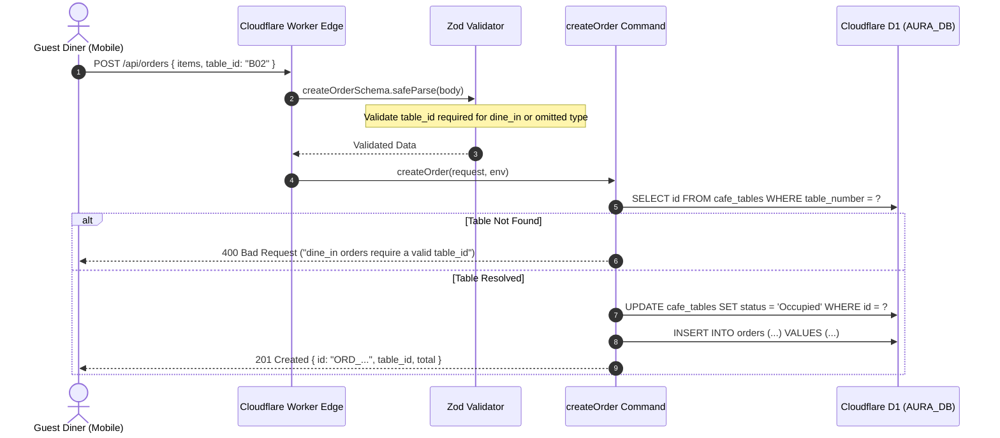

# Phase 1 — API Boundary & Security Invariants

## Context Links
- Overview Plan: [plan.md](./plan.md)
- Backend Backlog: `docs/BACKEND_TODO.md`
- Backend Review: `docs/BACKEND_REVIEW.md`
- Order Command: `packages/domain/order/commands/create-order.ts`
- Order Validator: `worker/src/lib/validators/order.ts`
- Payment Link Command: `packages/domain/payment/commands/payos-create-link.ts`
- Reservation Routes: `packages/domain/reservation/src/routes/reservations.ts`
- Order Read Handlers: `worker/src/routes/openapi-orders-handlers/order-read-handlers.ts`

---

## Overview
- **Priority**: P0 (Critical / Blocker)
- **Current Status**: Completed
- **Brief Description**: Fix the edge-level security and data integrity vulnerabilities where dine-in orders could be created without a valid table, ensure guest diners can checkout seamlessly via PayOS without authentication blockers, enforce role-based access control on customer reservation management, and eliminate SQL injection risks on order query sorting.

---

## Key Insights
1. **Dine-In Table Enforcement Bug**: Currently, `createOrderSchema.superRefine` only checks `data.table_id` when `data.order_type === 'dine_in'`. If the client omits `order_type`, it passes schema validation, but `createOrder` defaults to `order_type || 'dine_in'` during insertion with `resolvedTableId: null`. This generates orphan dine-in tickets that break KDS display stations.
2. **Guest Diner Checkout Path**: Guest diners scanning QR codes at tables do not possess bearer JWT tokens. `payOSCreateLink` must allow unauthenticated users to create payment links for orders while preventing IDOR (ensuring authenticated users cannot pay or tamper with other users' private orders).
3. **Reservation PII Protection**: Vietnam Decree 13/2023/ND-CP and standard data privacy practices require reservation listings (`GET /api/reservations`) and status updates (`PATCH /:id/approve`, `PATCH /:id/reject`, `DELETE /:id`) to require `['owner', 'staff', 'manager']` roles. Public customers should only be able to create bookings and check availability slots.
4. **SQL Parameter Whitelisting**: SQLite does not support parameter binding for `ORDER BY` column names or direction. Any sorting parameter must be strictly mapped against an explicit dictionary whitelist.

---

## Requirements

### Functional Requirements
- When `order_type` is omitted or set to `'dine_in'`, a valid `table_id` (table number from QR) is required and must resolve to an existing table in `cafe_tables`. Return 400 `VALIDATION_ERROR` if missing or invalid.
- `POST /api/payment/create-link` must succeed for anonymous guest orders without requiring an `Authorization` header.
- `GET /api/reservations`, `PATCH /api/reservations/:id/approve`, `PATCH /api/reservations/:id/reject`, and `DELETE /api/reservations/:id` must return 401 Unauthorized for unauthenticated requests and 403 Forbidden for customer roles.
- `GET /api/orders` sorting query parameter must accept only whitelisted columns (`created_at`, `total_amount`, `status`, `order_number`, `total`) and default to `created_at DESC` on invalid input.

### Non-Functional Requirements
- Zero latency degradation on order placement (sub-50ms D1 lookups).
- Backward compatibility with existing QR table codes formatted as `"B01"`, `"B02"`, `"A01"`, etc.

---

## Architecture & Data Flow



---

## Related Code Files

### Files to Modify
- `worker/src/lib/validators/order.ts`: Update `createOrderSchema` superRefine to check table requirement when `order_type` is omitted or `'dine_in'`.
- `packages/domain/order/commands/create-order.ts`: Ensure `resolvedTableId` is enforced whenever `data.order_type === 'dine_in' || !data.order_type`.
- `packages/domain/payment/commands/payos-create-link.ts`: Ensure guest payment link generation succeeds seamlessly while preserving IDOR checks for authenticated users.
- `packages/domain/reservation/src/routes/reservations.ts`: Verify `requireAuth(['owner', 'staff', 'manager'])` wraps all administrative endpoints.
- `worker/src/routes/openapi-orders-handlers/order-read-handlers.ts`: Verify `ALLOWED_SORT_COLUMNS` strictly sanitizes SQL query string.

### Test Files to Add/Update
- `packages/domain/order/__tests__/create-order-table-validation.test.ts`: Verify dine-in table requirement on omitted/explicit types.
- `packages/domain/payment/__tests__/payos-guest-checkout.test.ts`: Verify guest payment link creation without auth headers.
- `packages/domain/reservation/__tests__/reservations-auth.test.ts`: Verify 401/403 security protections on reservation management endpoints.

---

## Implementation Steps

1. **Step 1: Harden Table Validation in Schema & Command**
   - In `worker/src/lib/validators/order.ts`, update `superRefine`:
     ```typescript
     const isDineIn = !data.order_type || data.order_type === 'dine_in';
     if (isDineIn && !(data.table_id ?? '').trim()) {
       ctx.addIssue({
         code: z.ZodIssueCode.custom,
         path: ['table_id'],
         message: 'Số bàn là bắt buộc với đơn tại quán',
       });
     }
     ```
   - In `packages/domain/order/commands/create-order.ts`, ensure `resolvedTableId` guard checks `(!data.order_type || data.order_type === 'dine_in')`.

2. **Step 2: Verify Guest PayOS Payment Link Creation**
   - In `packages/domain/payment/commands/payos-create-link.ts`:
     - Confirm `optionalAuth()` middleware is active.
     - Confirm ownership check only blocks if `orderRow.customer_id && customerId && orderRow.customer_id !== customerId && !isStaffOrOwner`.
     - Confirm unauthenticated guest callers (`customerId === null`) can pay for guest orders (`orderRow.customer_id === null`).

3. **Step 3: Audit Reservation Route Security**
   - Verify `reservationsRouter` in `packages/domain/reservation/src/routes/reservations.ts`:
     - `GET /` -> protected with `requireAuth(['owner', 'staff', 'manager'])`.
     - `PATCH /:id/approve` -> protected with `requireAuth(['owner', 'staff', 'manager'])`.
     - `PATCH /:id/reject` -> protected with `requireAuth(['owner', 'staff', 'manager'])`.
     - `DELETE /:id` -> protected with `requireAuth(['owner', 'staff', 'manager'])`.
     - Public routes: `POST /` (new reservation creation) and `GET /availability` remain accessible to dining guests.

4. **Step 4: Verify Whitelist for SQL Sorting**
   - In `worker/src/routes/openapi-orders-handlers/order-read-handlers.ts`:
     - Verify `ALLOWED_SORT_COLUMNS` contains `created_at`, `total_amount`, `status`, `order_number`, `total`.
     - Enforce fallback to `o.created_at DESC` whenever client passes unapproved column names or SQL injection payloads (`'; DROP TABLE orders; --`).

---

## Todo List
- [x] Update `createOrderSchema` in `worker/src/lib/validators/order.ts` to enforce `table_id` when `order_type` is `'dine_in'`.
- [x] Update `createOrder` command in `packages/domain/order/commands/create-order.ts` to require valid `resolvedTableId` for all dine-in orders.
- [x] Add unit test verifying 400 error when placing dine-in order without table number.
- [x] Add unit test verifying successful guest checkout PayOS payment link creation.
- [x] Add unit test verifying 401 on unauthenticated reservation listing.
- [x] Run `npx tsc --noEmit` and verify 0 type errors.
- [x] Run test suite and confirm all tests pass.

---

## Success Criteria
- Request `POST /api/orders` with `{ items: [...], customer_name: "Test", customer_phone: "0901234567" }` (omitted `order_type` and `table_id`) returns HTTP 400 with message `'Số bàn là bắt buộc với đơn tại quán'`.
- Request `POST /api/orders` with `{ items: [...], customer_name: "Test", customer_phone: "0901234567", table_id: "B02" }` returns HTTP 201 with resolved `table_id`.
- Request `POST /api/payment/create-link` without Authorization header succeeds and returns `{ success: true, payment_url: "..." }`.
- Request `GET /api/reservations` without Authorization header returns HTTP 401.

---

## Risk Assessment & Mitigation
- **Risk**: Existing automated tests or mock callers might create orders without `table_id`.
  - **Mitigation**: Grep test files for order creation payloads; update any legacy test cases that omitted `order_type` to either supply `table_id: 'B01'` or `order_type: 'takeaway'`.
- **Risk**: QR code scanning on mobile devices might send lowercase table names (`"b02"` vs `"B02"`).
  - **Mitigation**: Case-insensitive lookup in `cafe_tables` or normalize input with `.toUpperCase()`.

---

## Security Considerations
- Prevents unauthenticated scraping of customer PII (phone numbers, full names, booking times).
- Eliminates potential SQL injection vectors in order queries.
- Prevents table spoofing where dine-in orders occupy non-existent tables.
