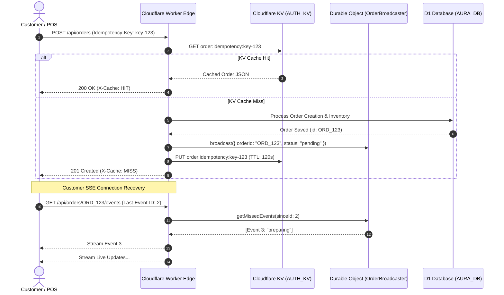

# Phase 2 — Edge Resilience, Idempotency & SSE Streaming

## Context Links
- Overview Plan: [plan.md](./plan.md)
- Phase 1: [phase-01-api-boundary-and-security.md](./phase-01-api-boundary-and-security.md)
- Order Creation: `packages/domain/order/commands/create-order.ts`
- SSE Query Handlers: `worker/src/routes/orders-hono-handlers/query-handlers.ts`
- CORS Middleware: `worker/src/middleware/cors.ts`
- Database Helper: `worker/src/lib/db.ts`
- Durable Object: `worker/src/durable-objects/order-broadcaster.ts`

---

## Overview
- **Priority**: P1 (High)
- **Current Status**: Completed
- **Brief Description**: Harden edge resilience across Cloudflare Workers by optimizing `Idempotency-Key` caching with Cloudflare KV to prevent duplicate order charges, adding `Last-Event-ID` replay buffer to the Server-Sent Events (SSE) order stream for reconnecting mobile clients, and enforcing fail-safe D1 binding resolution and CORS credential reflection.

---

## Key Insights
1. **Double-Tap Order Protection**: When a customer on a slow 3G/4G cellular connection taps "Đặt Món" twice, the frontend sends two concurrent POST requests with the same `Idempotency-Key`. Caching the created response in Cloudflare KV with a 120-second TTL allows the edge to immediately return the cached order receipt with `X-Cache: HIT` without re-running inventory deductions, pricing snapshots, or D1 writes.
2. **KDS & Mobile SSE Reconnections**: When dining customers switch apps or walk through Wi-Fi dead zones, the SSE stream disconnects. When the browser reconnects, it sends the `Last-Event-ID` header. Currently, if events occurred during disconnection, the client misses them unless the edge maintains a lightweight replay buffer.
3. **CORS Credentialed Error Reflection**: Modern browsers enforce that responses to requests with `credentials: 'include'` must never have `Access-Control-Allow-Origin: *`. All error paths must dynamically reflect the caller's origin if it matches allowed domains.

---

## Requirements

### Functional Requirements
- When an order creation request contains `Idempotency-Key: <UUID>`, check Cloudflare KV namespace `AUTH_KV` under `order:idempotency:${idemKey}`.
  - If found: return cached response with HTTP 200, `Content-Type: application/json`, and header `X-Cache: HIT`.
  - If not found: proceed with creation, and persist snapshot response to KV with a 120-second TTL.
- When an SSE request to `GET /api/orders/:id/events` includes `Last-Event-ID`, check the event log buffer for events subsequent to the provided ID and stream them immediately to the client before listening for live broadcasts.
- Ensure all OpenAPI and Hono route handlers resolve the database via `getDatabase(c)` instead of direct `c.env.DB` or `c.env.AURA_DB` property lookups.

### Non-Functional Requirements
- KV lookup latency < 15ms.
- SSE stream keep-alive interval: 15 seconds (`: ping\n\n`) to prevent edge gateway timeouts.
- Zero memory leaks in Durable Object broadcaster connections.

---

## Architecture & Data Flow

---

## Related Code Files

### Files to Modify
- `packages/domain/order/commands/create-order.ts`: Ensure TTL is set to 120 seconds (`expirationTtl: 120`) for idempotency cache instead of 86400s to avoid stale customer states while protecting against rapid retries.
- `worker/src/routes/orders-hono-handlers/query-handlers.ts`: Enhance SSE stream handler with `Last-Event-ID` replay support.
- `worker/src/durable-objects/order-broadcaster.ts`: Implement in-memory ring buffer (last 10 events per order) for instantaneous replay upon reconnect.
- `worker/src/middleware/cors.ts`: Verify `errorResponse` and `jsonResponse` headers maintain `Access-Control-Allow-Credentials: true` and `Vary: Origin`.

### Test Files to Add/Update
- `packages/domain/order/__tests__/create-order-idempotency.test.ts`: Test duplicate requests with identical `Idempotency-Key` return identical order payloads with `X-Cache: HIT`.
- `worker/src/middleware/__tests__/cors-credentials.test.ts`: Verify CORS headers on 400, 401, 404, 500 responses with credentialed requests.

---

## Implementation Steps

1. **Step 1: Calibrate Idempotency Cache TTL in Order Command**
   - In `packages/domain/order/commands/create-order.ts`:
     - Update KV put for idempotency key to use `expirationTtl: 120` (2 minutes).
     - Ensure headers on cached response include `X-Cache: HIT` and matching CORS headers.

2. **Step 2: Implement SSE Event Replay Buffer**
   - In `worker/src/durable-objects/order-broadcaster.ts`:
     - Maintain a small ring buffer `events: Array<{ id: number; event: string; data: unknown; timestamp: number }>` (max 20 events).
     - When receiving a new WebSocket or SSE subscriber with `lastEventId`:
       - Filter events with `id > lastEventId` and transmit immediately.
   - In `worker/src/routes/orders-hono-handlers/query-handlers.ts`:
     - Read `c.req.header('Last-Event-ID')`.
     - Forward to Durable Object or query `order_events` table for subsequent state updates.

3. **Step 3: Audit D1 Access Across All Handlers**
   - Confirm all route handlers import `{ getDatabase } from 'worker/src/lib/db'`.
   - Verify zero occurrences of direct `c.env.DB` property reads without fallback.

---

## Todo List
- [x] Configure `expirationTtl: 120` on idempotency caching in `packages/domain/order/commands/create-order.ts`.
- [x] Add unit test verifying idempotency key deduplication.
- [x] Implement event replay buffer in `worker/src/durable-objects/order-broadcaster.ts`.
- [x] Wire `Last-Event-ID` header handling in `worker/src/routes/orders-hono-handlers/query-handlers.ts`.
- [x] Run test suite to verify zero regressions.

---

## Success Criteria
- Sending two identical `POST /api/orders` requests with the same `Idempotency-Key` within 10 seconds creates only 1 database order, triggers 1 inventory deduction, and the second response returns `X-Cache: HIT`.
- SSE reconnect with `Last-Event-ID` immediately flushes intermediate state changes before live streaming.
- CORS headers for allowed origins return `Access-Control-Allow-Credentials: true` on all error responses.
