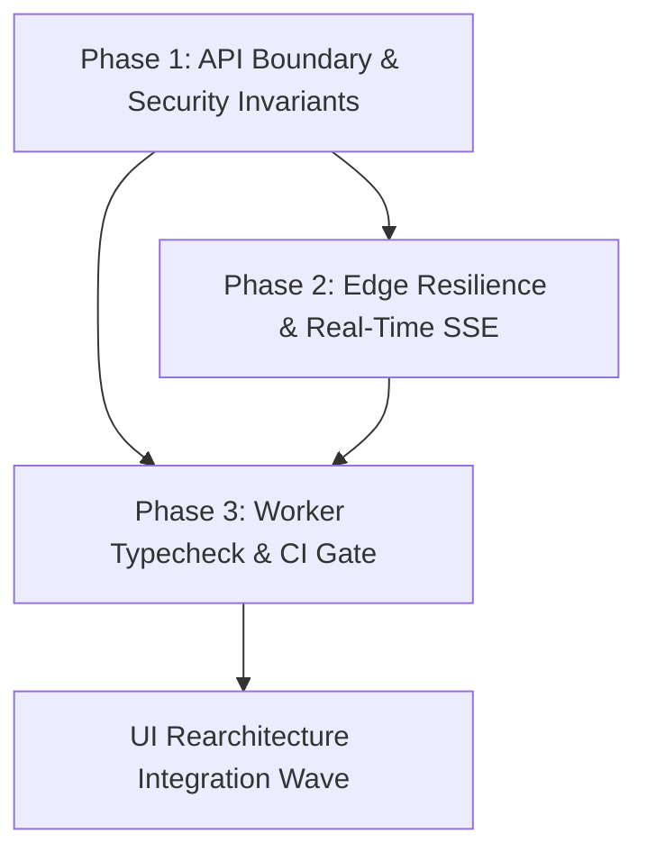

# AURA Backend Stabilization & Edge Resilience Plan

## Executive Summary
Comprehensive implementation plan to resolve backend edge defects, eliminate silent fallbacks, strengthen data integrity, and guarantee 100% type safety and contract adherence across Cloudflare Worker and domain packages for AURA CAFE.

## Current Baseline
- **Build**: Root `npx tsc --noEmit` passing (0 errors).
- **Test Baseline**: 3,475+ green tests across monorepo packages.
- **Production Status**: Cloudflare Pages (`auraspace.cafe`) and Cloudflare Worker deployed and verified live.

---

## Phases Overview

| Phase | Title | Priority | Scope | Status |
| :--- | :--- | :--- | :--- | :--- |
| **Phase 1** | [API Boundary & Security Invariants](./phase-01-api-boundary-and-security.md) | P0 (Critical) | Table validation, guest checkout, reservation authorization, sort sanitization | **Completed** |
| **Phase 2** | [Edge Resilience, Idempotency & SSE Streaming](./phase-02-edge-resilience-and-realtime.md) | P1 (High) | Idempotency KV TTL, SSE event replay buffer, D1 binding unification | **Completed** |
| **Phase 3** | [Worker Typecheck, Contracts & CI Automation](./phase-03-typecheck-contracts-and-ci.md) | P1/P2 (Quality) | Worker tsc zero-errors, OpenAPI/Scalar validation, automated CI gate | **Completed** |

---

## Phase Dependencies

---

## Core Invariants & Quality Gates
1. **Server-Authoritative Invariants**: No client-driven totals or unvalidated table assignments.
2. **Zero-Trust Role Enforcing**: Reservation PII and administrative actions strictly guarded by role middleware.
3. **Zero Compilation Regressions**: `npx tsc --noEmit` and worker typecheck must yield 0 errors.
4. **Zero Test Regressions**: All 3,475+ existing tests must remain green.
