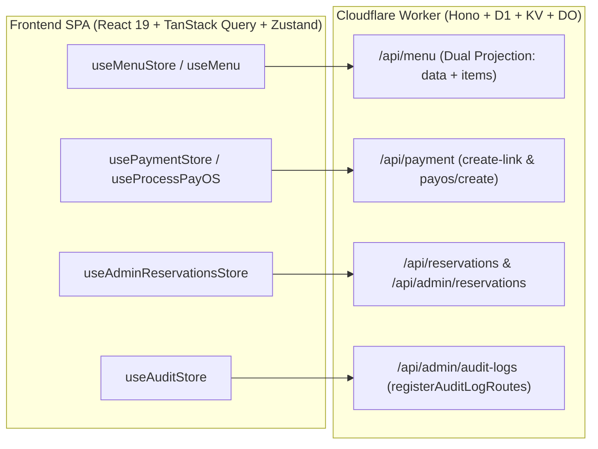

# AURA FE ↔ BE Integration & Assembly Plan

## Executive Summary
Comprehensive implementation plan to assemble and bridge the React SPA Frontend and Cloudflare Worker Backend for AURA CAFE. Eliminates all route mismatches, DTO contract gaps, and missing router mountings while preserving 100% test baselines and zero technical debt.

## Integration Architecture & Bridges

---

## Phases Overview

| Phase | Scope | Focus | Status |
| :--- | :--- | :--- | :--- |
| **Phase 1** | Catalog & Menu DTO Bridge | Dual projection on `/api/menu`, unpack in `use-menu-store` & `use-menu` | Completed |
| **Phase 2** | PayOS Payment Route Alignment | Dual route aliasing `/api/payment/create-link` & `/payos/create`, validator robustness | Completed |
| **Phase 3** | Admin Reservation & Audit Logs Routing | Mount `/api/admin/reservations` & `/api/admin/audit-logs`, dual-safe store calls | Completed |
| **Phase 4** | Verification & Zero Technical Debt | Root tsc, worker typecheck, 3,557+ Vitest suite, zero regressions | Completed |

---

## Key Invariants & Non-Negotiables
1. **Zero Breaking Changes**: M4-B canonical contracts (`{ success: true, data: { categories } }`) remain 100% intact for domain consumers.
2. **Dual-Sided Resilience**: Both backend handlers and frontend stores handle both legacy and canonical DTO shapes.
3. **Zero Technical Debt**: Zero TypeScript errors (`tsc --noEmit` & `typecheck:worker`), zero Vitest regressions.
4. **Security Invariant**: Owner/staff role enforcement strictly maintained on all admin and reservation management routes.
