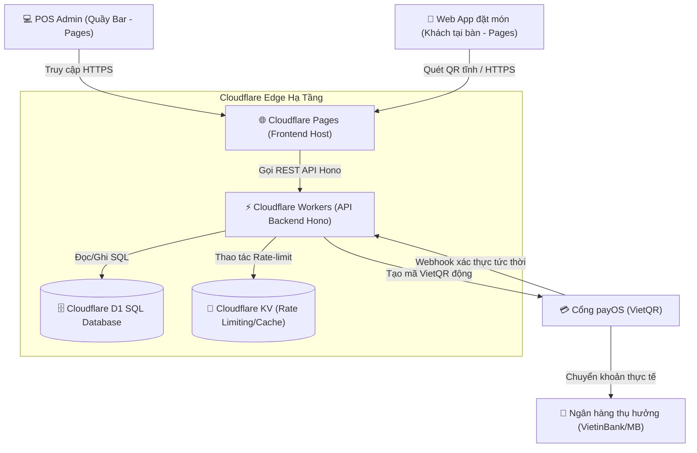

# 💳 Phase 1: Hệ Thống POS & Đặt Hàng Serverless (Ordering)
> **Trụ cột công nghệ:** 01 (POS Web Client), 02 (Dine-in Web App), 03 (VietQR Payments), 04 (Auto-Reconciliation)  
> **Trạng thái:** Sẵn sàng triển khai  

Tài liệu này cung cấp thiết kế kiến trúc chi tiết, đặc tả API và hướng dẫn tích hợp cho hệ thống POS quầy bar, Web App đặt hàng tại bàn tự phục vụ, kết nối cơ sở dữ liệu Cloudflare D1 và cổng thanh toán payOS VietQR của **AURA CAFE Sa Đéc**.

---

## 1. Sơ Đồ Kiến Trúc Serverless Thực Tế



---

## 2. Trụ Cột 1: Cơ Sở Dữ Liệu Cloudflare D1 & Pages Frontend

Hệ thống đặt món và POS Admin được phát triển bằng HTML5/CSS/JavaScript thuần (Vite + Vanilla JS), lưu trữ và phân phối trên **Cloudflare Pages** cho phép tải trang tức thời và bảo mật HTTPS mặc định. Giao diện quầy bar được thiết kế Offline-First, sử dụng **IndexedDB** tại trình duyệt để ghi nhận đơn hàng tạm thời nếu kết nối internet bị gián đoạn.

Dữ liệu của toàn hệ thống được lưu trữ tập trung tại **Cloudflare D1 SQL Database** thông qua cấu hình `wrangler.toml` của Worker. Các bảng cốt lõi phục vụ Phase 1 bao gồm:
*   `categories`: Danh mục đồ uống/đồ ăn nhẹ của quán.
*   `products`/`menu_items`: Thông tin chi tiết các món nước, giá cả, ảnh minh họa và trạng thái khả dụng.
*   `cafe_tables`: Danh sách bàn trong container cafe kèm mã vùng định vị.
*   `orders`: Ghi nhận toàn bộ đơn hàng ( dine-in, mang đi) kèm trạng thái thanh toán, tổng số tiền, giảm giá từ voucher và điểm tích lũy.
*   `payments`: Trạng thái chi tiết các giao dịch payOS phục vụ đối soát tự động.

---

## 3. Trụ Cột 2: Backend API Hono chạy trên Cloudflare Workers

Toàn bộ logic nghiệp vụ được xử lý ở cận biên (Edge) qua Cloudflare Workers, viết bằng framework Hono siêu nhẹ. Giao dịch đặt hàng và thanh toán được quản lý bởi hai route chính:

### API Đặt Hàng (`worker/src/routes/orders.js`)
Quản lý vòng đời đơn hàng từ lúc khởi tạo `pending`, chuẩn bị `preparing`, sẵn sàng `ready` cho đến khi giao món `delivered`. 

### API Thanh Toán (`worker/src/routes/payment.js`)
Khởi tạo giao dịch thanh toán payOS dựa trên số tiền thực tế cần trả (sau khi trừ đi giảm giá từ Voucher khai trương hoặc tiền mặt ví Cashback).

---

## 4. Trụ Cột 3 & 4: Tự Động Đối Soát Dòng Tiền Qua payOS VietQR Webhook

Khi khách hàng quét mã QR tĩnh dán tại bàn (ví dụ: bàn `A5`), Web App tự động nhận tham số bàn ➔ khách chọn món ➔ nhấn thanh toán ➔ Worker tạo link thanh toán payOS và nhận mã VietQR động chứa chính xác số tiền đơn hàng kèm nội dung chuyển khoản được định dạng sẵn.

### Lập Trình Tích Hợp Xử Lý Thanh Toán Serverless

Dưới đây là đặc tả logic Hono route xử lý Webhook xác thực giao dịch tức thời từ payOS gửi về (`worker/src/routes/webhooks.js`):

```javascript
import { Hono } from 'hono';
import PayOS from '@payos/node';
import { processOrderLoyalty } from './loyalty.js';

export const webhookRouter = new Hono();

// Khởi tạo SDK payOS với biến môi trường Cloudflare Worker
const getPayOS = (env) => {
  return new PayOS(
    env.PAYOS_CLIENT_ID,
    env.PAYOS_API_KEY,
    env.PAYOS_CHECKSUM_KEY
  );
};

// Endpoint nhận Webhook đối soát tự động tức thì
webhookRouter.post('/payos', async (c) => {
  const db = c.env.AURA_DB;
  const payos = getPayOS(c.env);
  const body = await c.req.json();

  try {
    // 1. Xác thực tính hợp lệ của chữ ký số từ payOS
    const verifiedData = payos.verifyPaymentWebhookData(body);
    console.log('✅ Xác thực giao dịch thành công:', verifiedData);

    const orderId = verifiedData.orderCode; // Mã đơn hàng số
    const transactionId = verifiedData.id;
    const amount = verifiedData.amount;
    const now = new Date().toISOString();

    // 2. Tìm đơn hàng tương ứng trong Cloudflare D1
    const order = await db.prepare('SELECT * FROM orders WHERE id = ?').bind(String(orderId)).first();
    if (!order) {
      return c.json({ success: false, error: 'Không tìm thấy đơn hàng' }, 404);
    }

    if (order.payment_status === 'paid') {
      return c.json({ success: true, message: 'Đơn hàng đã được thanh toán trước đó' });
    }

    // 3. Cập nhật giao dịch thanh toán và trạng thái đơn hàng bằng Batch D1
    await db.batch([
      // Cập nhật trạng thái đơn
      db.prepare('UPDATE orders SET status = ?, payment_status = ?, updated_at = ? WHERE id = ?')
        .bind('preparing', 'paid', now, String(orderId)),
      
      // Ghi nhận lịch sử giao dịch thanh toán
      db.prepare('INSERT INTO payments (id, order_id, method, amount, status, transaction_id, created_at, updated_at) VALUES (?, ?, ?, ?, ?, ?, ?, ?)')
        .bind('pay_' + Date.now().toString(36), String(orderId), 'payos', amount, 'completed', String(transactionId), now, now)
    ]);

    // 4. Kích hoạt tích điểm Loyalty và ví Cashback cho khách hàng
    await processOrderLoyalty(String(orderId), c.env);

    return c.json({ success: true, message: 'Đối soát và cập nhật đơn hàng thành công!' });
  } catch (error) {
    console.error('❌ Lỗi Webhook đối soát:', error.message);
    return c.json({ success: false, error: 'Chữ ký Webhook không hợp lệ' }, 400);
  }
});
```

---

## 5. Quy Trình Vận Hành LAN Offline-First & Dự Phòng Mạng Biên

Để đảm bảo hoạt động bán hàng không bao giờ bị gián đoạn tại Sa Đéc, hệ thống áp dụng cơ chế dự phòng sau:

1.  **Chế độ Web POS Offline-First**:
    *   Trình duyệt POS quầy bar lưu trữ danh mục sản phẩm vào **IndexedDB**.
    *   Khi mất kết nối internet hoàn toàn, nhân viên bar vẫn tạo đơn bình thường. Đơn hàng được gắn cờ `offline_pending` và lưu cục bộ.
    *   Khi kết nối internet phục hồi, POS tự động đồng bộ hóa các đơn lưu tạm lên Cloudflare D1 database.
2.  **Dự phòng Mạng Đa Kênh Mikrotik (Multi-WAN)**:
    *   Router Mikrotik tại quán cấu hình 2 cổng WAN: Cáp quang chính (Viettel) và bộ phát 4G phụ (SIM MobiFone/VinaPhone).
    *   Cấu hình cơ chế **Failover tự động trong 5 giây**. Nếu cáp quang Viettel gặp sự cố, Router tự động chuyển toàn bộ luồng mạng sang 4G để duy trì kết nối thanh toán VietQR động và nhận đơn tại bàn.
