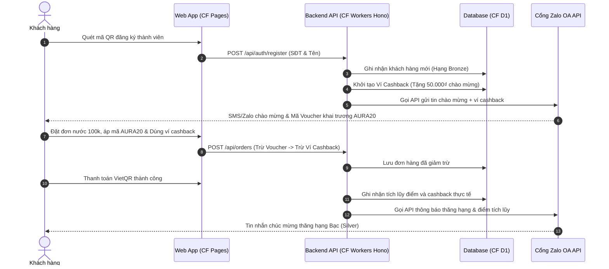

# 🤝 Phase 2: Hệ Thống Loyalty, Referral & Zalo OA Automation
> **Trụ cột công nghệ:** 05 (Ví Cashback & Loyalty Engine), 06 (Mã Giảm Giá Vouchers), 07 (Referral Loop - Giới thiệu bạn), 08 (Tự Động Hóa Zalo OA CRM)  
> **Trạng thái:** Sẵn sàng triển khai  

Tài liệu này đặc tả chi tiết cấu trúc dữ liệu, các thuật toán tích điểm/cashback và luồng giao tiếp tiếp thị tự động qua Zalo OA được phát triển nguyên bản chạy trên nền tảng Serverless Cloudflare cho **AURA CAFE Sa Đéc**.

---

## 1. Sơ Đồ Luồng Tương Tác Khách Hàng (Serverless Loyalty)

---

## 2. Trụ Cột 5: Custom Headless Loyalty Engine & Ví Cashback

Thay vì tích điểm theo thẻ giấy truyền thống dễ thất lạc, AURA CAFE tích hợp ví Cashback tự động gắn liền với số điện thoại khách hàng trên Cloudflare D1.

### Quy Tắc Tích Lũy & Tiêu Dùng Cashback v2:
1.  **Phân hạng thành viên**:
    *   **Bronze (Đồng)**: Tặng 50k ngày khai trương. Tỷ lệ hoàn tiền **3%**.
    *   **Silver (Bạc)**: Đạt từ 50 điểm (hoặc tiêu dùng >= 200k ngày khai trương). Tỷ lệ hoàn tiền **5%**.
    *   **Gold (Vàng)**: Đạt từ 200 điểm. Tỷ lệ hoàn tiền **7%**.
    *   **Platinum (Bạch Kim)**: Đạt từ 500 điểm. Tỷ lệ hoàn tiền **10%**.
2.  **Nguyên lý quy đổi điểm**:
    *   Mỗi **10,000₫ thực chi** trên hóa đơn tích lũy được **1 điểm**. Điểm số này dùng làm chỉ số để xét thăng hạng thành viên (`lifetime_points`).
3.  **Hạn mức tiêu dùng Ví Cashback**:
    *   Mỗi đơn hàng tối thiểu **30,000₫** mới đủ điều kiện sử dụng tiền mặt trong ví Cashback.
    *   Mức tiêu dùng tối đa là **50% tổng giá trị hóa đơn** (sau khi đã trừ giảm giá của mã voucher). Điều này bảo vệ biên lợi nhuận ròng của quán, không cho phép khách thanh toán 100% bằng cashback.
4.  **Chốt chặn chống lặp điểm (Anti-Loss Shield)**:
    *   *Tính cashback trên thực chi*: Điểm số và cashback mới chỉ được tích trên phần tiền mặt thanh toán thực tế (`Cash Paid` = Tổng đơn - Voucher - Cashback đã dùng). Tránh lỗ hổng khách dùng cashback thanh toán để lại đẻ ra cashback mới.

---

## 3. Trụ Cột 6: Tích Hợp Vouchers Khai Trương (Mã Giảm Giá)

Hệ thống cho phép cấu hình và áp dụng các mã Voucher khai trương linh hoạt (ví dụ: `AURA20` giảm 20% hóa đơn gộp).

### Công thức tính dòng tiền chuẩn hóa:
$$\text{Gross Total (Hóa đơn gộp)} \xrightarrow{\text{Trừ Voucher (Mã giảm giá)}} \text{Subtotal 1} \xrightarrow{\text{Trừ Cashback đã dùng (Tối đa 50\%)}} \text{Cash Paid (Tiền mặt thực trả)}$$
$$\text{Cash Paid} \xrightarrow{\text{Tích lũy Loyalty}} \text{Điểm mới} + \text{Cashback hoàn lại ví}$$

Quy trình này được bảo mật thông qua giao dịch ACID Batch của D1 SQLite, ngăn chặn hoàn toàn hiện tượng Race Condition (gian lận nhấn thanh toán nhiều lần để trừ ví âm).

---

## 4. Trụ Cột 7: Referral Loop (Giới Thiệu Bạn Bè - Tăng Trưởng Mạng Lưới)

Mỗi khách hàng đăng ký thành viên sẽ được cấp một mã giới thiệu độc nhất (ví dụ: `AURAREF123`).

*   **Cơ chế cộng thưởng**: Khi người được giới thiệu (User B) đăng ký tài khoản qua link giới thiệu của User A và phát sinh đơn hàng đầu tiên tối thiểu **30,000₫** thành công ➔ Hệ thống tự động kích hoạt Webhook cộng ngay **200 điểm** thưởng vào tài khoản của người giới thiệu (User A) và ghi nhận giao dịch tại bảng `referrals`.
*   Điều này giúp quán container cafe đạt mức tăng trưởng người dùng tự nhiên (hữu cơ) ở Sa Đéc với chi phí tiếp thị rẻ nhất.

---

## 5. Trụ Cột 8: Zalo OA Automation & Chăm Sóc Khách Hàng Tự Động

Tất cả các biến động tài khoản thành viên đều được đồng bộ hóa tức thì tới Zalo của khách hàng thông qua API Zalo OA (`worker/src/routes/zalo.js`):

1.  **Welcome Message**: Chào mừng đăng ký mới, thông báo tặng 50k ví cashback.
2.  **Transaction Alert**: Gửi hóa đơn điện tử, thông báo số tiền mặt đã thanh toán VietQR, số cashback đã dùng và số cashback được hoàn mới vào ví.
3.  **Tier Upgrade Alert**: Thông báo chúc mừng khi khách hàng tích lũy đủ điểm thăng hạng (ví dụ: từ Bronze thăng hạng Silver).
