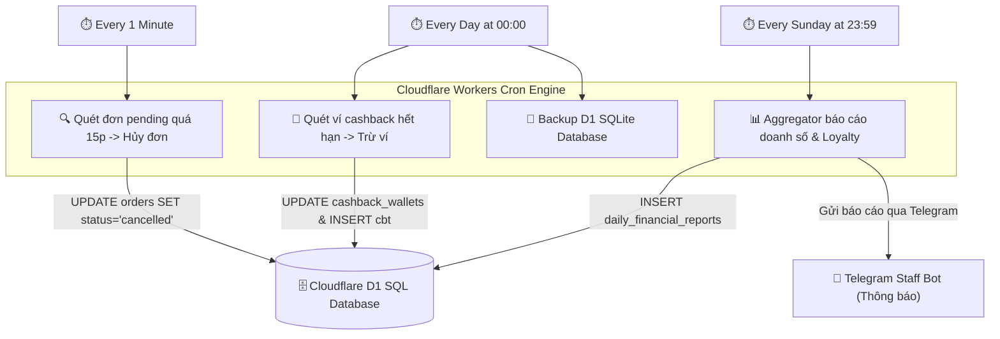

# ⚙️ Phase 3: Ca Trực, Báo Cáo & Tự Động Hóa Chạy Ngầm (Serverless Backend)
> **Trụ cột công nghệ:** 09 (Quản lý ca trực Shifts), 10 (Hệ thống Báo cáo Reports), 11 (Tác vụ chạy ngầm Worker Crons)  
> **Trạng thái:** Sẵn sàng triển khai  

Tài liệu này đặc tả chi tiết kiến trúc tự động hóa back-office của **AURA CAFE Sa Đéc**, bao gồm việc theo dõi ca trực của nhân viên, trích xuất dữ liệu báo cáo tài chính đa chiều và cấu hình các tác vụ chạy ngầm tự động (Scheduled Crons) trên hạ tầng Cloudflare Workers biên.

---

## 1. Sơ Đồ Quy Trình Tự Động Hóa Chạy Ngầm (Workers Cron)

---

## 2. Trụ Cột 9: Quản Lý Ca Trực Nhân Viên (Staff Shifts)

Để đảm bảo minh bạch trong vận hành và tính toán chi phí nhân sự chính xác tại container cafe, hệ thống tích hợp API quản lý ca trực (`worker/src/routes/shifts.js`) trực tiếp trên D1.

### Quy Trình Nghiệp Vụ Ca Trực:
1.  **Đăng ký ca trực**: Quản lý thiết lập ca làm việc cho nhân viên quầy bar (ca sáng, ca chiều, ca tối) lưu trữ vào bảng `staff_shifts`.
2.  **Chấm công (Punch In/Out)**: Nhân viên sử dụng POS Client để quét mã QR nội bộ và nhấn điểm danh ca trực. Hệ thống lưu trữ thời gian thực và vị trí dựa trên IP mạng LAN VLAN 10 của quán để tránh chấm công hộ từ xa.
3.  **Giao ca & Đối soát quỹ**: Khi kết thúc ca trực, nhân viên kiểm đếm số tiền mặt thực tế tại quầy, đối chiếu với tổng đơn hàng thanh toán VietQR động trong ca trực để báo cáo sai lệch trực tiếp lên D1.

---

## 3. Trụ Cột 10: Trích Xuất Báo Cáo Tài Chính Đa Chiều (Reports)

API báo cáo (`worker/src/routes/reports.js`) trích xuất số liệu động từ D1 để cung cấp bảng điều khiển (CTO Dashboard) thời gian thực cho chủ quán:

*   **Báo cáo doanh thu**: Tổng doanh số gộp, chiết khấu khuyến mãi từ Voucher, số tiền cashback đã chi trả và số tiền mặt thực thu đối soát qua ngân hàng.
*   **Chỉ số Loyalty & Retention**: Số lượng thành viên mới đăng ký, tỷ lệ thăng hạng thành viên Bronze/Silver/Gold/Platinum, số lượng khách quay lại mua hàng từ lần 2 trở đi.
*   **Thống kê sản phẩm (Menu Analytics)**: Món uống bán chạy nhất (Top Sellers), khung giờ cao điểm có lượng đặt đơn nhiều nhất để sắp xếp nhân sự quầy bar phù hợp.

---

## 4. Trụ Cột 11: Tác Vụ Chạy Ngầm Tự Động (Cloudflare Workers Cron)

Tận dụng tính năng **Scheduled Triggers** của Cloudflare Workers, hệ thống triển khai các tác vụ tự động hóa chạy ngầm mà không tốn chi phí thuê máy chủ riêng:

### 1. Quét Dọn Đơn Treo Trạng Thái (`cron.js`)
*   *Tần suất*: 1 phút/lần.
*   *Nghiệp vụ*: Quét toàn bộ đơn hàng có trạng thái `pending` và phương thức thanh toán VietQR nhưng quá 15 phút chưa nhận được Webhook thanh toán thành công từ payOS ➔ Tự động cập nhật `status = 'cancelled'` để giải phóng bàn và hoàn trả nguyên vật liệu.

### 2. Thu Hồi Cashback Hết Hạn (`cron.js`)
*   *Tần suất*: Hằng ngày lúc 00:00.
*   *Nghiệp vụ*: Dựa trên hạng thành viên của khách hàng, cashback tích lũy sẽ có hạn sử dụng (ví dụ: Bronze là 90 ngày, Silver là 120 ngày). Worker tự động quét các giao dịch `earn` đã quá hạn sử dụng, tính toán số dư thực tế và thực hiện giao dịch `expire` để trừ tiền trong ví cashback của khách hàng, đảm bảo an toàn nợ tích lũy cho quán.

### 3. Tự Động Sao Lưu Dữ Liệu D1 Database
*   *Tần suất*: Hằng ngày lúc 02:00 sáng (giờ thấp điểm).
*   *Nghiệp vụ*: Kích hoạt lệnh snapshot và sao lưu định kỳ cơ sở dữ liệu D1 sang Cloudflare R2 Storage, gửi tin nhắn xác nhận trạng thái sao lưu thành công về nhóm Telegram của chủ quán.
