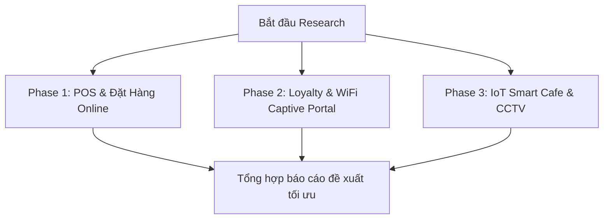

# 📊 Kế Hoạch Nghiên Cứu GitHub: Kho Phần Mềm Mở Cho F&B Container Cafe

**Mục tiêu**: Nghiên cứu, đánh giá và lựa chọn các kho mã nguồn mở (GitHub Repositories) chất lượng cao, có nhiều lượt đánh giá (stars) và phù hợp nhất với mô hình 12 cột trụ công nghệ của **AURA CAFE Sa Đéc** nhằm tối ưu chi phí vận hành tiệm cận 0đ.

---

## 🎯 Lộ Trình Thực Hiện (Roadmap)

## 🛠️ Phân Chia Các Giai Đoạn (Phases & TODOs)

### [Phase 1: POS & Đặt Hàng Online](file:///Users/mac/mekong-cli/FnB-Container-Caffe/plans/260522-github-research/phase-01-pos-ordering.md)
*   [ ] Đánh giá Odoo POS (LGPL v3) & các giải pháp POS thay thế (opensourcepos, NexoPOS, Floreant).
*   [ ] Đánh giá TastyIgniter (MIT) cho hệ thống đặt món online tự vận hành tại Sa Đéc.
*   [ ] Tích hợp cổng thanh toán Napas VietQR & payOS (payOSHQ SDKs).

### [Phase 2: Loyalty, WiFi & Social Marketing](file:///Users/mac/mekong-cli/FnB-Container-Caffe/plans/260522-github-research/phase-02-loyalty-marketing.md)
*   [ ] Nghiên cứu Open Loyalty và Stampee (TypeScript) cho hệ thống tích điểm/cashback.
*   [ ] Nghiên cứu OpenWISP Captive Portal quản lý WiFi Marketing thu thập lead.
*   [ ] Nghiên cứu Mixpost & Mautic tự động hóa bài đăng, chiến dịch chăm sóc khách hàng.

### [Phase 3: IoT Smart Cafe, Signage & AI CCTV](file:///Users/mac/mekong-cli/FnB-Container-Caffe/plans/260522-github-research/phase-03-smart-cctv.md)
*   [ ] Nghiên cứu Home Assistant (Smart Container, HVAC tự động hóa tiết kiệm điện).
*   [ ] Nghiên cứu Frigate CCTV (AI Object Detection, đếm lượng khách, heatmap).
*   [ ] Nghiên cứu Xibo & Anthias cho màn hình Menu Board kỹ thuật số.

---

> [!IMPORTANT]
> **Cam kết của Antigravity:** Mọi repo được nghiên cứu đều phải tuân thủ giấy phép nguồn mở thương mại (MIT, LGPL, Apache 2.0, AGPL) để chủ quán tự làm chủ dữ liệu 100%, không bị khóa trói bởi nhà cung cấp SaaS thương mại.
