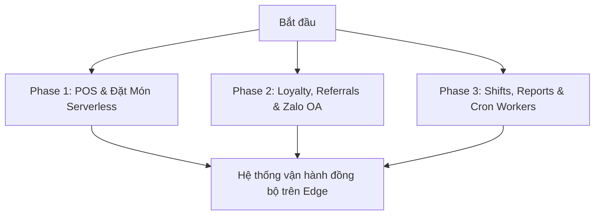

# 📊 Kế Hoạch Quy Hoạch: Kiến Trúc Serverless Cho AURA CAFE Sa Đéc

**Mục tiêu**: Thiết kế, chuẩn hóa và đặc tả kiến trúc Serverless chạy hoàn toàn trên hạ tầng đám mây biên (Cloudflare Edge) nhằm tối ưu hóa chi phí vận hành tiệm cận 0đ, đạt tốc độ phản hồi siêu tốc (<50ms) và loại bỏ hoàn toàn sự phụ thuộc vào phần cứng vật lý cồng kềnh (không máy chủ local NUC, không thiết bị IoT phức tạp, không liên quan năng lượng mặt trời).

---

## 🎯 Lộ Trình Triển Khai Thực Tế (Roadmap)

---

## 🛠️ Phân Chia Các Giai Đoạn Vận Hành (Phases)

### 1. [Phase 1: POS & Đặt Hàng Serverless (Ordering)](file:///Users/mac/mekong-cli/FnB-Container-Caffe/plans/260522-github-research/phase-01-pos-ordering.md)
*   **Hạ tầng**: Lưu trữ và phục vụ giao diện tĩnh qua Cloudflare Pages (POS Admin & Table Web App).
*   **Lõi xử lý**: API Gateway viết trên Cloudflare Workers sử dụng Hono framework (`worker/src/routes/orders.js`, `orders-hono.js`).
*   **Cơ sở dữ liệu**: Dữ liệu lưu trữ tập trung tại cơ sở dữ liệu phân tán Cloudflare D1 SQL database (`worker/schema.sql`).
*   **Thanh toán**: Tích hợp cổng payOS trực tiếp để tự động tạo mã VietQR động theo đơn hàng và đối soát tức thời qua Webhook bảo mật.

### 2. [Phase 2: Headless Loyalty & Marketing Engine](file:///Users/mac/mekong-cli/FnB-Container-Caffe/plans/260522-github-research/phase-02-loyalty-marketing.md)
*   **Lõi Loyalty**: Custom Engine quản lý Ví Cashback, điểm thành viên và đổi thưởng trực tiếp trên Worker (`worker/src/routes/loyalty.js`).
*   **Hạng thành viên**: Bronze, Silver, Gold, Platinum tự động tích điểm và nâng hạng dựa trên thực chi dòng tiền thực tế.
*   **Lan tỏa (Referrals)**: Hệ thống giới thiệu bạn bè tự sinh mã và cộng điểm thưởng kép (`worker/src/routes/referrals.js`).
*   **Tự động hóa**: Kết nối thông báo trạng thái giao dịch và thăng hạng tức thời tới khách hàng qua Zalo OA API (`worker/src/routes/zalo.js`).

### 3. [Phase 3: Shifts, Reports & Cron Automations](file:///Users/mac/mekong-cli/FnB-Container-Caffe/plans/260522-github-research/phase-03-serverless-automation.md)
*   **Quản lý nhân sự**: Theo dõi ca trực và chấm công trực quan của nhân viên quầy bar (`worker/src/routes/shifts.js`).
*   **Báo cáo tài chính**: Tổng hợp doanh thu, biên lợi nhuận ròng, thống kê khách hàng và các kịch bản dòng tiền ngay trên D1 database (`worker/src/routes/reports.js`).
*   **Tác vụ chạy ngầm (Workers Cron)**: Quét dọn tự động ví cashback hết hạn, đồng bộ báo cáo ca trực và backup dữ liệu định kỳ (`worker/src/routes/cron.js`).

---

> [!IMPORTANT]
> **Cam Kết Kiến Trúc Không Phần Cứng (Zero-Hardware Serverless):**
> AURA CAFE Sa Đéc vận hành 100% không cần máy chủ vật lý local, không camera AI (Frigate), không Smart Home IoT (Home Assistant) hay thiết bị điều khiển Smart Lights/Solar. Điều này giúp loại bỏ hoàn toàn chi phí bảo trì phần cứng, rủi ro mất điện cục bộ tại quán và mang lại tính sẵn sàng cực cao (99.99%).
