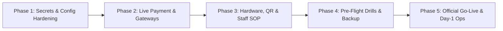

# Plan: AURA CAFE Go-Live Master Roadmap

**Project:** AURA CAFE — Container Coffee & Space (Sa Đéc, Đồng Tháp)  
**Target:** Production Go-Live & Store Launch  
**Date:** 2026-09-10  
**Stack:** Cloudflare Pages (SPA/Vite/M3) + Cloudflare Workers (Hono/OpenAPI/TS) + D1 (SQLite) + PayOS + Zalo OA  

---

## Executive Summary

The codebase (UI, Menu, Loyalty 4-tier, POS, KDS, Order state machine) is verified and deployed. To safely execute the commercial store launch, the system requires 5 sequential go-live phases transitioning from infrastructure hardening to physical store operations.

---

## Master Phases & Mekong CLI Commands

| Phase | Focus Area | Mekong CLI Command | Status |
|---|---|---|---|
| **Phase 1** | Production Secrets, Campaign Window & Security Lockdown | `mekong sec-scan`, `mekong code:check` | 🟡 Ready |
| **Phase 2** | Live PayOS Gateway, Webhook Handshake & ZNS Alerts | `mekong ci:run-ci`, `mekong qa-e2e` | ⚪ Queued |
| **Phase 3** | Table QR Stickers, Thermal Receipt POS & Staff SOP Drill | `mekong tasks-todo`, `mekong cook` | ⚪ Queued |
| **Phase 4** | E2E Pre-flight Simulation, D1 Snapshot & Offline Runbook | `mekong sre-morning-check`, `mekong ops-health` | ⚪ Queued |
| **Phase 5** | Official Launch Day Monitoring, Live Triage & Day-1 Debrief | `mekong daily`, `mekong ops-status` | ⚪ Queued |

---

## Sub-Phase Detail References

- [Phase 1: Security, Secrets & Date Window Alignment](./phase-01-security-secrets-campaign-alignment.md)
- [Phase 2: Payment Gateway & Communications Handshake](./phase-02-payment-notifications-gateway.md)
- [Phase 3: Hardware, Table QR & Staff Operations Pilot](./phase-03-store-hardware-qr-staff-sop.md)
- [Phase 4: Pre-Flight Drills, Backup & Smoke Test](./phase-04-preflight-smoke-test-backup.md)
- [Phase 5: Official Launch Day Operations & Monitoring](./phase-05-official-launch-monitoring.md)
