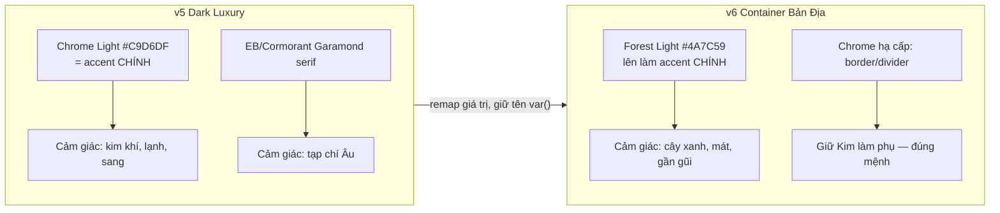

# UX Design Report — Re-positioning AURA CAFE từ "Dark Luxury" → "Quán Cà Phê Container Bản Địa"

Date: 2026-08-26 | Skill: ui-ux-pro-max | Scope: advisory (chưa sửa code)

---

## 1. Audit — Dữ liệu hiện tại vs Kiến trúc thực tế

### 1.1 Brand system hiện tại (verified)

| Thành phần | Giá trị | File |
|---|---|---|
| Aesthetic | "Dark luxury with chrome/silver accents" | `src/styles/brand-tokens.css:5` |
| Palette | Noir navy (#050D1A–#25406B) + Chrome/Silver (#C9D6DF) + Forest green | `brand-tokens.css` §1 |
| Fonts khai báo | EB Garamond (display) + Space Grotesk (body) | `brand-tokens.css` §2 |
| Fonts THỰC TẾ load | **Cormorant Garamond** + Space Grotesk | `index.html:15-16` ⚠️ lệch pha |
| Theme | Dark-only (base = noir; `[data-theme="dark"]` chỉ alias lại chính nó) | `brand-tokens.css:340` |
| Price range | VND 15,000–65,000 (bình dân) | `src/pages/home.tsx:40` |
| Địa điểm thực | Sa Đéc, Đồng Thap — thị xã tỉnh lẻ | JSON-LD `home.tsx` |

### 1.2 Mâu thuẫn phát hiện (gap analysis)

1. **Font mismatch**: tokens khai báo EB Garamond nhưng index.html load Cormorant Garamond → display font rơi vào fallback Georgia trên phần lớn máy.
2. **Gold sót lại**: `StitchLandingNew-hero.tsx:76` hardcode gradient `#B48554`; `pages/stitch/luxury-landing/index.tsx:33` dùng `#D4A574→#B48554`. Vi phạm cả v5 ("REVERT Gold → Chrome") lẫn quy tắc Bát tự (**cấm Hỏa/Thổ** — vàng đồng là Kim Hỏa ấm).
3. **Copy "Tây quá"**: vi.json có ~15 chuỗi luxury: "thượng hạng", "bản giao hưởng kiến trúc độc bản", "tuyên ngôn phong cách sống", "phòng riêng thép tối màu", alt-text "ánh đèn vàng ấm áp"…
4. **Tên 5 zone 100% tiếng Anh**: Jade Counter / Sky Deck / Noir Cabin / Aura Lounge / **VIP Steel Nest** (`vi.json:1328-1337`) — khách Sa Đéc không gọi được.
5. **Surface lớn**: 333 file .tsx tham chiếu token aura-*; 65 stitch components dùng glass/blur → refactor toàn bộ KHÔNG khả thi; phải remap giá trị tại token layer (KISS).

### 1.3 Ràng buộc không được phá (sticky decisions)

- **Founder Manifesto**: Bát tự Nhật chủ 壬 Thủy Dương — chỉ Navy/Chrome(Kim)/Mộc(green); **cấm tuyệt đối Hỏa & Thổ** (`docs/00_FOUNDER_MANIFESTO.md`). Mọi đề xuất "warm wood/rustic nâu" đều BỊ LOẠI.
- MD3 Strict Mode (rules/m3-strict.md): semantic tokens, không raw hex trong component.
- Dark-first là nền tảng trải nghiệm đêm (rooftop, bar) — giữ.

---

## 2. Kiến trúc thiết kế mới — "Container Bản Địa" (Local Industrial)

### 2.1 Positioning shift

```
TRƯỚC: "Industrial-luxury rooftop — bản giao hưởng kiến trúc" (khách du lịch/sang trọng)
SAU:   "Quán container xịn xò giữa Sa Đéc — ngồi chill, làm việc, gặp bạn" (người địa phương 18-45)
```

Nguyên tắc: **giữ khung tối navy** (đúng mệnh Thủy + 333 files), **thay chất liệu cảm xúc**: bớt "kim loại bóng sang chảnh" → tăng "xanh mộc mạc gần gũi"; bớt serif thời trang → font tròn thân thiện đọc tốt dấu tiếng Việt.

### 2.2 Token Remap (sửa GIÁ TRỊ trong brand-tokens.css, GIỮ TÊN token)



| Token | Giá trị cũ | Giá trị mới v6 | Lý do |
|---|---|---|---|
| `--aura-primary` | chrome-light (bạc kim) | **forest-light #4A7C59** | Mộc làm chủ đạo = xanh cây quán vỉa hè, thân thiện |
| `--aura-secondary` | forest-primary | chrome-light | Đảo vai; Kim làm điểm nhấn phụ |
| `--aura-accent-warm` | chrome-mid | **forest-pale #A8C5A0** | "Ấm" ở đây = xanh non, KHÔNG phải vàng (cấm Thổ/Hỏa) |
| `--aura-font-display` | 'EB Garamond' serif | **'Quicksand'** (subset vi ✓) | Tròn, thân thiện, đọc dấu tốt |
| `--aura-font-body` | 'Space Grotesk' | **'Be Vietnam Pro'** (subset vi ✓) | Thiết kế riêng cho tiếng Việt |
| `--aura-glass-blur` | 16px + glass panels dày | 8px + giảm opacity | Bớt "cocktail lounge", thêm rõ ràng phẳng |
| Glow/chrome effects | glow mạnh hero | giảm 50%, bỏ gold gradient sót | Hạ nhiệt độ sang chảnh |

Không đổi: toàn bộ noir surfaces (bg/card/border), radius scale, spacing, motion durations.

### 2.3 Kiến trúc phân lớp sau remap

```
┌─ index.html ──────────────────────────────┐
│ load fonts: Quicksand + Be Vietnam Pro    │  ← sửa 1 dòng/link
│ (bỏ Cormorant Garamond, Space Grotesk)    │
└──────────────┬────────────────────────────┘
               ▼
┌─ brand-tokens.css (v6) ───────────────────┐   ← SỬA GIÁ TRỊ TẠI ĐÂY
│  --aura-primary: forest-light             │     333 file .tsx KHÔNG đụng tới
│  --aura-font-*: Quicksand/BVP             │
└──────────────┬────────────────────────────┘
               ▼
┌─ global.css @theme ───────────────────────┐   ← đã map var() sẵn, không đổi
└──────────────┬────────────────────────────┘
               ▼
┌─ Components (333 files) ──────────────────┐   ← chỉ sửa chỗ HARD CODE:
│ • StitchLandingNew-hero.tsx:76  #B48554   │     ~4 vị trí hex gold
│ • luxury-landing/index.tsx:33   #D4A574   │
└───────────────────────────────────────────┘
```

### 2.4 Chuẩn hoá tiếng Việt (Vietnamize copy)

**Zone names** (vi.json landing):

| Old (EN) | New (VI bản địa) |
|---|---|
| Jade Counter | **Quầy Pha Chế** |
| Sky Deck | **Sân Thượng** |
| Noir Cabin | **Góc Yên Tĩnh** |
| Aura Lounge | **Khu Sofa** |
| VIP Steel Nest | **Phòng Riêng** |

**Copy luxury → bản địa** (sample; full list khi implement):

| Key | Old | New |
|---|---|---|
| `heroTagline` | Sa Đéc · Cà Phê Cao Cấp | Sa Đéc · Cà Phê Container |
| `heroDescription` | "…cà phê container thượng hạng… bản giao hưởng kiến trúc độc bản" | "Quán container rộng, thoáng, có sân thượng mát. Cà phê ngon giá bình dân — ngồi chill cả buổi." |
| `pageAriaLabel` | …quán cà phê container sang trọng | …quán cà phê container tại Sa Đéc |
| `storyLead` | …trải nghiệm cà phê cao cấp | …góc làm việc & tụ tập bạn bè từ container tái chế |
| `zone5Desc` | Không gian cao cấp — phòng riêng thép tối màu | Phòng máy lạnh riêng — họp nhóm, làm việc yên tĩnh |
| `galleryMainAlt` | …sang trọng vào ban đêm với ánh đèn vàng ấm áp | …ban đêm với đèn dây ấm |

EN.json cập nhật song song ("premium coffee" → "container coffee space").

### 2.5 UX guardrail áp dụng

- Contrast: forest-light #4A7C59 trên noir-deep #0A1A2E ≈ 3.9:1 → dùng cho accent/large text; body text vẫn chrome-bright/text-primary (≥4.5:1 ✓). CTA filled dùng forest-primary với on-primary sáng.
- Touch targets, focus ring, reduced-motion: đã có sẵn trong global.css — không đổi.
- Icon: lucide-react nhất quán (đã đúng), thay mọi emoji còn sót (nếu có).

---

## 3. Kế hoạch triển khai đề xuất (3 phase nhỏ)

| Phase | Việc | Files | Rủi ro |
|---|---|---|---|
| P1 Tokens+Fonts | Remap giá trị brand-tokens.css v6 + index.html font links + xoá 4 hex gold | 3 files | Thấp — giữ tên token |
| P2 Copy VI/EN | vi.json/en.json: zones + luxury strings (~20 key) | 2 files | Thấp — test snapshot i18n nếu có |
| P3 Verify | tsc + FE tests + visual check 375px/dark | - | - |

Ước lượng: nửa phiên. Không đụng 333 file .tsx.

---

## Unresolved Questions

1. Đổi tên route `/stitch/luxury-landing` (+ luxury-landing-hero) → giữ nguyên (internal URL, ít thấy) hay đổi cho sạch?
2. `luxuryTax: "Thuế cao cấp (5%)"` ở checkout — đây là business term thật hay copy? Cần xác nhận trước khi đổi.
3. Logo/wordmark "AURA CAFE" giữ nguyên chữ Latin (nhận diện) — xác nhận?
