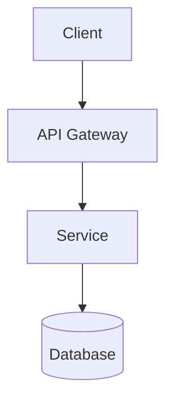

# Architecture Design Prompt

**Purpose:** Design system architecture for a new feature or project.

## Instructions

When given a goal or requirements, produce:

1. **Context** — Links to relevant docs (GOAL, existing architecture)
2. **Requirements Analysis** — Functional and non-functional requirements extracted
3. **Architecture Options** — 2-3 viable approaches with pros/cons
4. **Recommended Approach** — Chosen solution with rationale
5. **Component Diagram** — ASCII or Mermaid showing components and data flow
6. **API Design** — Endpoints, request/response examples
7. **Database Schema** — Tables, fields, relationships (if applicable)
8. **Security Considerations** — Auth, authorization, data protection
9. **Deployment Topology** — Where components run (edge, cloud, on-prem)
10. **ADR Draft** — Architecture Decision Record ready for review

## Template

```markdown
# ARCHITECTURE: [Feature Name]

## Context
- Related: [GOAL.md link], [existing ARCHITECTURE.md section]
- Team: [owner], [reviewers]

## Requirements
### Functional
- [ ] Feature 1
- [ ] Feature 2

### Non-Functional
- Performance: [latency targets]
- Scalability: [expected load]
- Security: [compliance requirements]

## Options Considered

### Option A: [Name]
**Pros:**
- Pro 1
- Pro 2

**Cons:**
- Con 1
- Con 2

### Option B: [Name]
...

## Recommendation

**Chosen: Option X**

**Rationale:**
- Reason 1
- Reason 2

## Architecture Diagram



## API Design

| Endpoint | Method | Description |
|----------|--------|-------------|
| `POST /api/feature` | Create | ... |

**Request example:**
```json
{ "field": "value" }
```

**Response example:**
```json
{ "id": 123, "status": "ok" }
```

## Database Schema

```sql
CREATE TABLE feature (
    id INTEGER PRIMARY KEY,
    name TEXT NOT NULL,
    ...
);
```

## Security
- Authentication: [JWT / OAuth / API key]
- Authorization: [role-based, scope-based]
- Data protection: [encryption at rest, TLS in transit]

## Deployment
- [ ] Cloudflare Workers
- [ ] D1 database
- [ ] KV cache

## ADR (to be created)

File: `06_ADR/NNNN-[decision-slug].md`

**Status:** Draft

---

*This prompt is used by the `/ck:architect` skill.*
