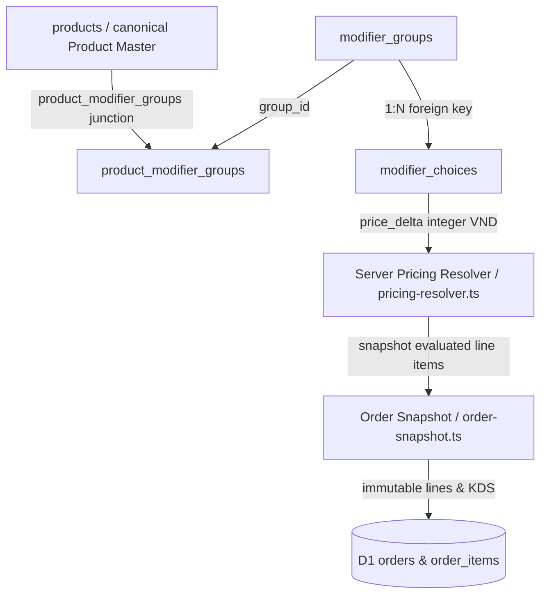

# Catalog Modifier Canonical Contract Report

## 1. Modifier Contract

### Canonical Runtime Model

### Core Hierarchy & Invariants
1. **`modifier_groups`**:
   - Master option groups (`id TEXT PRIMARY KEY`, `name TEXT`, `type TEXT ('single' | 'multiple')`, `required INTEGER (0 | 1)`, `sort_order INTEGER`, `is_active INTEGER DEFAULT 1`).
2. **`modifier_choices`**:
   - Individual choices (`id TEXT PRIMARY KEY`, `group_id TEXT FK`, `name TEXT`, `price_delta INTEGER DEFAULT 0`, `is_default INTEGER (0 | 1)`, `sort_order INTEGER`, `is_available INTEGER DEFAULT 1`).
3. **`product_modifier_groups`**:
   - Product-to-group linkage (`product_id TEXT`, `group_id TEXT`, `sort_order INTEGER`, `PRIMARY KEY (product_id, group_id)`).

### Enforced Contract Rules
1. **Canonical Price Delta**: `modifier_choices.price_delta` from SQLite D1 is the sole source of modifier pricing. Any client-submitted `price_delta` or `priceAdjustment` is strictly discarded.
2. **Deterministic Rejection on Unknown ID**: Any choice ID not found in `modifier_choices` triggers deterministic rejection with `{ code: 'invalid_modifier' }`.
3. **Product Ownership Boundary**: Modifier choices must belong to a modifier group linked to the product in `product_modifier_groups`. Unlinked modifiers trigger rejection with `{ code: 'invalid_modifier' }`.
4. **Availability & Active Checks**: Any choice with `is_available = 0` or belonging to a group with `is_active = 0` triggers deterministic rejection with `{ code: 'modifier_unavailable' }`.
5. **Selection Invariants**:
   - Duplicate choice selections trigger deterministic rejection with `{ code: 'duplicate_modifier' }`.
   - Selecting multiple choices for a single-choice group (`type: 'single'`) triggers deterministic rejection with `{ code: 'duplicate_modifier' }`.
6. **TEXT Identifier Invariant**: Modifier IDs remain uppercase alphanumeric TEXT tokens (`MG-*`, `MC-*`); no forced UUID migration.
7. **Sole Pricing Authority**: Server-side pricing resolver (`@aura/domain-catalog/policies/pricing-resolver.ts`) and modifier validator (`modifier-validation.ts`) remain the single authority; frontend is never authoritative.

---

## 2. Canonical Ownership

| Domain Concern | Canonical Owner | File Path |
| :--- | :--- | :--- |
| Modifier Model Types | Catalog Domain Models | `packages/domain/catalog/model/catalog-types.ts` |
| Modifier Validation Engine | Catalog Modifier Policy | `packages/domain/catalog/policies/modifier-validation.ts` |
| Modifier DB Queries | Catalog Modifier Queries | `packages/domain/catalog/policies/modifier-validation-queries.ts` |
| Server Pricing Engine | Catalog Pricing Resolver | `packages/domain/catalog/policies/pricing-resolver.ts` |
| Line Item Snapshotting | Order Domain Policy | `packages/domain/order/policies/order-snapshot.ts` |
| Modifier CRUD & Bindings | Catalog Commands Router | `packages/domain/catalog/commands/menu-modifiers.ts` |
| Customer/KDS Serialization | Order Projection Helpers | `worker/src/routes/openapi-orders-handlers/helpers.ts` |
| D1 Schema Definition | D1 Migration & Core Schemas | `worker/db/migrations/20261007_02_catalog_modifiers_contract.sql` |

---

## 3. Changed Files

1. `packages/domain/catalog/policies/modifier-validation.ts` (NEW, 161 LOC)
   - Core validator enforcing choice existence, availability, group active status, single-choice limits, product-group linkage, and duplicate prevention.
2. `packages/domain/catalog/policies/modifier-validation-queries.ts` (NEW, 86 LOC)
   - D1 query helpers abstracting `modifier_choices`, `modifier_groups`, and `product_modifier_groups` lookups.
3. `packages/domain/catalog/policies/pricing-resolver.ts` (MODIFIED, 149 LOC)
   - Integrated with `validateProductModifiers`, propagating rejections directly.
4. `packages/domain/catalog/model/catalog-types.ts` (MODIFIED)
   - Added `is_active` to `ModifierGroup` and `is_available` to `ModifierChoice`.
5. `packages/domain/catalog/index.ts` (MODIFIED)
   - Exported `validateProductModifiers`, `ModifierValidationRejection`, and `ModifierValidationResult`.
6. `packages/domain/catalog/commands/menu-modifiers.ts` (MODIFIED, 132 LOC)
   - Added `is_active` and `is_available` persistence to group and choice creation endpoints.
7. `packages/domain/order/policies/order-snapshot.ts` (MODIFIED, 195 LOC)
   - Expanded `OrderSnapshotRejection['code']` to include `'invalid_modifier' | 'modifier_unavailable' | 'duplicate_modifier'`.
8. `worker/src/routes/openapi-orders-handlers/helpers.ts` (MODIFIED)
   - Added fallback projection for `m.price_delta` into customer `priceAdjustment`.
9. `worker/src/routes/orders-hono-handlers/types.ts` (MODIFIED)
   - Added `modifiers?: unknown[]` to `OrderItem` interface.
10. `worker/db/migrations/20261007_02_catalog_modifiers_contract.sql` (NEW)
    - D1 migration for `modifier_groups`, `modifier_choices`, `product_modifier_groups`, and performance indexes.
11. `worker/schema.sql` & `db/schema.sql` (MODIFIED)
    - Synchronized modifier table definitions and indexes.
12. `worker/src/__tests__/integrations/server-pricing-test-helpers.ts` (MODIFIED)
    - Added `modifier_groups` and `product_modifier_groups` mock resolution.
13. `tests/m4c-order-price-snapshot.test.ts` (MODIFIED)
    - Updated mock D1 database to support modifier group and product mapping lookups.
14. `worker/src/__tests__/integrations/catalog-modifier-contract.test.ts` (NEW, 183 LOC)
    - Comprehensive 9-test suite verifying the 7 modifier contract scenarios.

---

## 4. Verification Matrix

| Test Scenario | Verification Result | Test File |
| :--- | :--- | :--- |
| Valid modifier | PASS | `catalog-modifier-contract.test.ts:98` |
| Invalid modifier (unknown ID) | PASS (`code: 'invalid_modifier'`) | `catalog-modifier-contract.test.ts:113` |
| Modifier from another product | PASS (`code: 'invalid_modifier'`) | `catalog-modifier-contract.test.ts:125` |
| Inactive choice (`is_available = 0`) | PASS (`code: 'modifier_unavailable'`) | `catalog-modifier-contract.test.ts:133` |
| Inactive group (`is_active = 0`) | PASS (`code: 'modifier_unavailable'`) | `catalog-modifier-contract.test.ts:140` |
| Duplicate selection (repeated ID) | PASS (`code: 'duplicate_modifier'`) | `catalog-modifier-contract.test.ts:147` |
| Multiple choices in single-group | PASS (`code: 'duplicate_modifier'`) | `catalog-modifier-contract.test.ts:154` |
| Tampered client `price_delta` | PASS (client delta discarded; DB delta used) | `catalog-modifier-contract.test.ts:98` |
| Product without modifiers | PASS (0 delta, unit price = base price) | `catalog-modifier-contract.test.ts:161` |
| Order snapshot integration | PASS (snapshot rejects, 0 subtotal, empty items) | `catalog-modifier-contract.test.ts:168` |

- **Automated Tests**: 24/24 tests passed (`catalog-modifier-contract.test.ts`, `server-pricing-contract.test.ts`, `m4c-order-price-snapshot.test.ts`).
- **TypeScript**: 0 errors (`npm run typecheck:all`).
- **ESLint**: 0 errors, 0 warnings (`npm run lint`).
- **File Length Constraint**: Every created and edited file strictly < 200 LOC.

---

## 5. Blockers

- **None**. The Catalog Modifier contract is fully locked, integrated, and verified across domain commands, policies, OpenAPI handlers, D1 schema migrations, and test suites.
