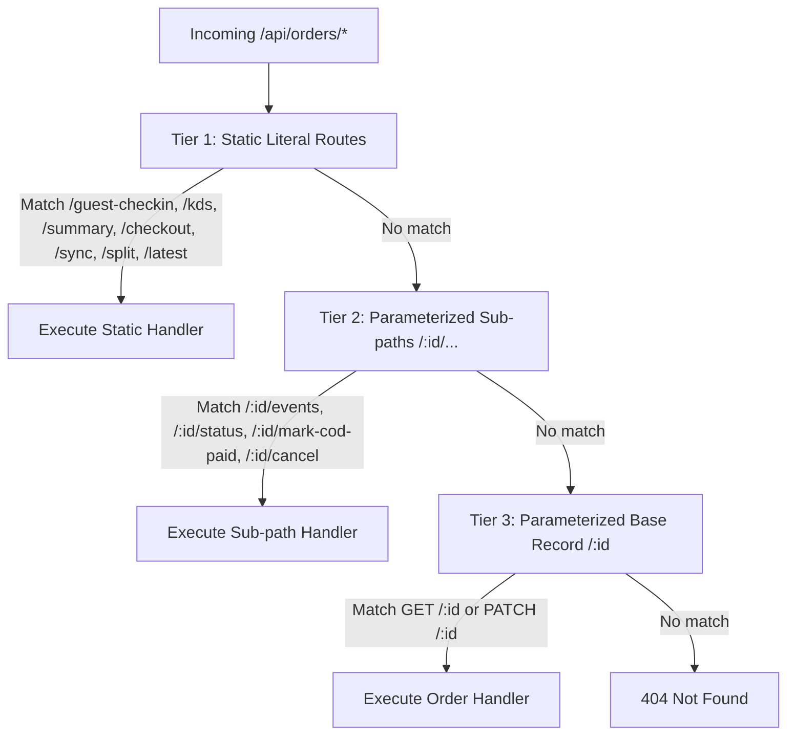

# Order Route Ownership Consolidation Report

## 1. Executive Summary

This audit and consolidation establishes **`ordersUnifiedRouter`** (`worker/src/routes/orders-unified.ts`) as the single, authoritative runtime owner for all `/api/orders` and `/api/kds/orders` endpoints.

- **Single Runtime Mount**: Removed redundant `app.route('/', openApiOrdersRouter)` from root `worker/src/index.ts`, eliminating route shadowing. `openApiOrdersRouter` remains mounted exclusively within `openApiApp` (`worker/src/lib/openapi.ts`) for OpenAPI 3.1 specification generation (`/api/json`) and Scalar documentation UI (`/api/docs`).
- **Canonical Snapshot Policy**: All order creation routes (`POST /api/orders`, `POST /api/orders/sync`, `POST /api/orders/checkout`) enforce the server-authoritative snapshot policy via `calculateOrderSnapshot` from `@aura/domain-order/policies/order-snapshot.ts`. Client prices, subtotals, and totals are ignored.
- **Strict Route Precedence**: Static literal paths (`/guest-checkin`, `/guest-checkout`, `/sync`, `/split`, `/latest`, `/kds`, `/checkout`, `/summary`) are registered before parameterized routes (`/:id`, `/:id/events`, `/:id/status`, `/:id/mark-cod-paid`, `/:id/cancel`), preventing wildcard shadowing.
- **Zero Parallel Order Creation Paths**: B2C and QR guest order creation goes through canonical `createOrder` engine with KV idempotency, Durable Object broadcast, `cafe_tables` validation, inventory deduction, and ERPNext sync.

---

## 2. Final Order Route Ownership Map

| HTTP Method | Runtime Route | Auth / Access | Canonical Handler | Domain Implementation |
| :--- | :--- | :--- | :--- | :--- |
| `POST` | `/api/orders` | Public / Rate Limited | `handleCreateOrder` | `packages/domain/order/commands/create-order.ts` |
| `GET` | `/api/orders` | Auth (`owner`, `manager`, `staff`, `customer`) | `handleListOrders` | `worker/src/routes/openapi-orders-handlers/order-read-handlers.ts` |
| `POST` | `/api/orders/guest-checkin` | Public (QR table check-in) | `handleGuestCheckin` | `worker/src/routes/orders-hono-handlers/guest-handlers.ts` |
| `POST` | `/api/orders/guest-checkout` | Public (QR table checkout) | `handleGuestCheckout` | `worker/src/routes/orders-hono-handlers/guest-handlers.ts` |
| `POST` | `/api/orders/sync` | Public (Offline sync with KV Idempotency) | `handleSyncOrders` | `worker/src/routes/orders-core.ts` (`createOrder`) |
| `POST` | `/api/orders/split` | Staff (`owner`, `staff`) | `handleSplitOrders` | `packages/domain/order/commands/split-orders.ts` |
| `GET` | `/api/orders/latest` | Public | `handleLatestOrderTimestamp` | `packages/domain/order/commands/latest-timestamp.ts` |
| `GET` | `/api/orders/kds` | Staff (`owner`, `staff`) | `handleGetKdsOrders` | `worker/src/routes/orders-hono-handlers/kds-handlers.ts` |
| `POST` | `/api/orders/checkout` | Staff (`owner`, `staff`) | `handlePosCheckout` | `worker/src/routes/orders-hono-handlers/checkout-handlers.ts` |
| `GET` | `/api/orders/summary` | Staff (`owner`, `manager`, `staff`) | `handleGetOrderSummary` | `worker/src/routes/openapi-orders-handlers/order-summary-handlers.ts` |
| `GET` | `/api/orders/:id/events` | Public (SSE order tracking) | `handleOrderStreamEvents` | `worker/src/routes/order-stream.ts` |
| `PATCH` | `/api/orders/:id/status` | Staff (`owner`, `staff`) | `handleUpdateOrderStatus` | `worker/src/routes/orders-hono-handlers/kds-handlers.ts` |
| `PATCH` | `/api/orders/:id/mark-cod-paid` | Owner (`owner`) | `handleMarkCodPaid` | `worker/src/routes/orders-hono-handlers/kds-handlers.ts` |
| `POST` | `/api/orders/:id/cancel` | Authenticated (`owner`, `manager`, `staff`, `customer`) | `handleCancelOrder` | `worker/src/routes/openapi-orders-handlers/order-cancel-handlers.ts` |
| `GET` | `/api/orders/:id` | Authenticated (Customer IDOR-scoped, Staff full) | `handleGetOrderById` | `worker/src/routes/openapi-orders-handlers/order-read-handlers.ts` |
| `PATCH` | `/api/orders/:id` | Staff (`owner`, `staff`) | `handleUpdateOrder` | `packages/domain/order/commands/update-order.ts` |
| `GET` | `/api/kds/orders` | Staff (`owner`, `staff`) | `handleListOrders` | `worker/src/routes/openapi-orders-handlers/order-read-handlers.ts` |
| `GET` | `/api/kds/orders/stream`| Staff (`owner`, `staff`) | `kdsStreamRouter` (`/stream`) | `packages/domain/kitchen/commands/kds-stream.ts` |

---

## 3. Kept vs. Retired Handlers Matrix

| Handler / Mount | File Location | Status | Rationale |
| :--- | :--- | :--- | :--- |
| `app.route('/', openApiOrdersRouter)` | `worker/src/index.ts:90` | **RETIRED** | Shadowed by `app.route('/api/orders', ordersUnifiedRouter)` at line 71. Specs already registered via `openApiApp`. |
| `ordersUnifiedRouter` | `worker/src/routes/orders-unified.ts` | **KEPT (Sole Runtime Owner)** | Consolidates all Hono, KDS, guest, and OpenAPI read/cancel handlers with strict precedence. |
| `createOrder` | `packages/domain/order/commands/create-order.ts` | **KEPT (Canonical Write)** | Enforces KV idempotency, Order Snapshot policy, `cafe_tables` join, DO broadcast, ERPNext sync, and inventory deduction. |
| `handleGetOrderById` | `worker/src/routes/openapi-orders-handlers/order-read-handlers.ts` | **KEPT (Canonical Read)** | Dual-mode projection: staff view includes operational metadata; customer view restricts to customer's own order. |
| `handleCancelOrder` | `worker/src/routes/openapi-orders-handlers/order-cancel-handlers.ts` | **KEPT (Canonical Cancel)** | Isolated order cancellation logic joining `cafe_tables`. |
| `handleGetOrderSummary` | `worker/src/routes/openapi-orders-handlers/order-summary-handlers.ts` | **KEPT (Canonical Summary)** | Modular aggregation handler (< 60 LOC) mounted at static literal path `/summary`. |
| `orders-hono-handlers/query-handlers.ts` | `worker/src/routes/orders-hono-handlers/` | **RETIRED (Previously)** | Handlers were previously consolidated into `order-read-handlers.ts`. |
| `ordersCoreRouter` | `worker/src/routes/orders-core.ts` | **RETIRED FROM ROOT** | Router is not mounted directly; its modular handlers are imported into `ordersUnifiedRouter`. |

---

## 4. Precedence & Wildcard Shadow-Proofing Analysis

In Hono, route matching follows registration order. Parameterized patterns (`/:id`) greedy-match static slugs if registered first. The consolidated `ordersUnifiedRouter` implements 3 distinct registration tiers:

### Verification Evidence
- `GET /api/orders/kds` is handled by `handleGetKdsOrders`, never captured by `GET /api/orders/:id` with `id = 'kds'`.
- `GET /api/orders/summary` is handled by `handleGetOrderSummary`, never captured by `GET /api/orders/:id` with `id = 'summary'`.
- `POST /api/orders/guest-checkin` is handled by `handleGuestCheckin`, never captured by `/:id`.
- `GET /api/orders/:id/events` initiates SSE stream before any generic `/:id` middleware.

---

## 5. Authentication & Public Boundaries

1. **Intentionally Public Flows**:
   - `POST /api/orders`: Allows walk-in customers and QR-code table diners to order without pre-registering account. Protected by IP rate limiting (`orderRateLimit`).
   - `POST /api/orders/guest-checkin`: Allows diners to seat at table (`cafe_tables`) and link phone number. Rate-limited.
   - `POST /api/orders/guest-checkout`: Allows diners to submit order with takeaway/dine-in selection.
   - `GET /api/orders/:id/events`: Allows guest diner browser to stream live SSE order status updates.
   - `POST /api/orders/sync`: Allows offline POS client to sync cached orders with `Idempotency-Key` headers.
   - `GET /api/orders/latest`: Polling check for latest order timestamp.

2. **Strictly Authenticated Staff Operations**:
   - `GET /api/orders/kds`: `requireAuth(['owner', 'staff'])`
   - `POST /api/orders/checkout`: `requireAuth(['owner', 'staff'])`
   - `GET /api/orders/summary`: `requireAuth(['owner', 'manager', 'staff'])`
   - `GET /api/orders`: `requireAuth(['owner', 'manager', 'staff', 'customer'])` (Customer scope filtered)
   - `GET /api/orders/:id`: `requireAuth(['owner', 'manager', 'staff', 'customer'])` (IDOR guarded)
   - `PATCH /api/orders/:id`: `requireAuth(['owner', 'staff'])`
   - `PATCH /api/orders/:id/status`: `requireAuth(['owner', 'staff'])`
   - `PATCH /api/orders/:id/mark-cod-paid`: `requireAuth(['owner'])`
   - `POST /api/orders/:id/cancel`: `requireAuth(['owner', 'manager', 'staff', 'customer'])`

---

## 6. Automated Verification Results

- **Typecheck**:
  - `tsc --noEmit`: Clean (0 errors)
  - `tsc --project worker/tsconfig.json --noEmit`: Clean (0 errors)
- **ESLint**:
  - `eslint worker/src/ --ext .ts`: Clean (0 errors, 0 warnings)
- **Unit & Integration Tests**:
  - `worker/src/__tests__/routes/orders-unified.test.ts`: **7/7 passed**
  - `worker/src/__tests__/integrations/order-snapshot-contract.test.ts`: **5/5 passed**
  - `worker/src/__tests__/routes/` (52 files): **419/419 passed**
  - Full worker test suite (168 files): **1,686/1,686 passed**
  - Full frontend test suite (342 files): **2,856/2,856 passed**
  - Full domain packages test suite (8 files): **90/90 passed**
- **File Length Constraints**:
  - `worker/src/index.ts`: 114 LOC (< 200 LOC)
  - `worker/src/routes/orders-unified.ts`: 75 LOC (< 200 LOC)
  - `worker/src/__tests__/routes/orders-unified.test.ts`: 179 LOC (< 200 LOC)

---

## 7. Blockers

- **0 Blockers**: Consolidation complete, all tests passing, contracts verified.
