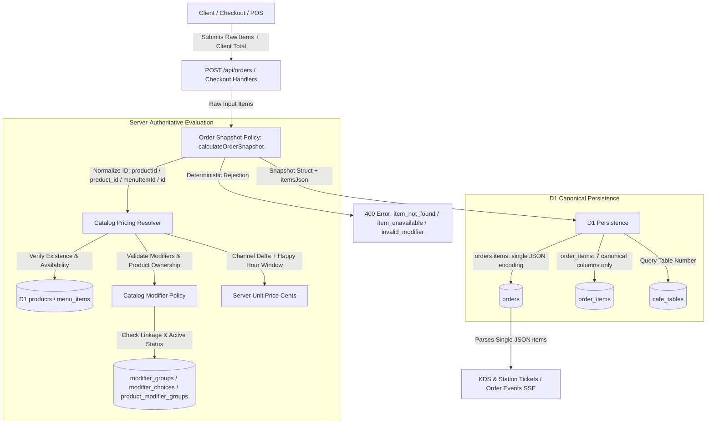

# Order Snapshot Canonical Contract Report

## 1. Snapshot Contract

### Canonical Runtime Architecture

### Core Hierarchy & Invariants

1. **Input Product ID Mapping**:
   - Normalized across `productId || product_id || menuItemId || id`. Line items consistently resolve their product identifier without field naming mismatch or dropped items.
2. **Product Existence & Deterministic Rejection**:
   - Products are queried against canonical `products` (with legacy fallback to `menu_items` for seed backward compatibility).
   - Missing product → deterministic rejection with `{ code: 'item_not_found', message: 'Product not found: <id>' }`.
   - Inactive or unavailable product (`is_available = 0` or `available = 0`) → deterministic rejection with `{ code: 'item_unavailable', message: 'menu item unavailable: <id>' }`.
3. **Catalog Modifier Validation**:
   - Line-item modifier selections are validated against `@aura/domain-catalog/policies/modifier-validation.ts`.
   - Modifier choices must belong to active groups mapped to the specific product in `product_modifier_groups`.
   - Invalid, cross-product, inactive, or duplicate modifier choices trigger deterministic rejection (`invalid_modifier`, `modifier_unavailable`, `duplicate_modifier`).
4. **Client Price Tampering Immunity**:
   - Client-supplied `price`, `subtotal`, and order `total` are completely ignored.
   - The server computes the authoritative line-item unit price as:
     $$\text{unitPriceCents} = \text{basePrice} + \Delta_{\text{channel}} + \sum \Delta_{\text{modifiers}} - \Delta_{\text{happy\_hour}}$$
   - Order total and subtotal are derived exclusively from server-computed line item subtotals.
5. **Single JSON Encoding Invariant**:
   - `snapshot.itemsJson` is a serialized JSON array of evaluated line items.
   - Handlers bind `snapshot.itemsJson` directly into `orders.items`, eliminating double JSON serialization (`"\"[{\\\"menuItemId\\\":...}]\""`).
   - Consumers (KDS, SSE streams, order history) parse `orders.items` directly as a valid JSON array.
6. **Immutable Display & KDS Snapshot**:
   - The snapshot array preserves frozen display data: `menuItemId`, `name`, `quantity`, `unitPriceCents`, `subtotalCents`, and frozen modifier choices (`name`, `price_delta`).
   - Downstream catalog edits or price updates cannot mutate historical orders or active KDS tickets.
7. **Canonical D1 `order_items` Persistence**:
   - Writes to `order_items` persist only the 7 columns defined in canonical D1 schema:
     `(id, order_id, product_id, quantity, subtotal, modifiers, created_at)`
   - Nonexistent fields (`variant_id`, `unit_price`, `total_price`, `notes`, `status`, `updated_at`) are excluded.
8. **Canonical `cafe_tables` Relational Integrity**:
   - All table joins across write, read, summary, cancel, and KDS handlers use `LEFT JOIN cafe_tables t ON o.table_id = t.id`.
   - References to the nonexistent `tables` table have been eliminated.
9. **Zero Duplicated Snapshot Logic**:
   - Both Hono core (`worker/src/routes/orders-core.ts`) and OpenAPI handlers (`worker/src/routes/openapi-orders-handlers/order-write-handlers.ts`) delegate order evaluation exclusively to `@aura/domain-order/policies/order-snapshot.ts`.

---

## 2. Canonical Ownership

| Domain Concern | Canonical Owner | File Path |
| :--- | :--- | :--- |
| Order Snapshot Policy | Order Domain Policy | `packages/domain/order/policies/order-snapshot.ts` |
| Server Pricing Resolver | Catalog Pricing Policy | `packages/domain/catalog/policies/pricing-resolver.ts` |
| Modifier Validation Policy | Catalog Modifier Policy | `packages/domain/catalog/policies/modifier-validation.ts` |
| OpenAPI Order Write Handler | Worker OpenAPI Handlers | `worker/src/routes/openapi-orders-handlers/order-write-handlers.ts` |
| OpenAPI Order Read Handler | Worker OpenAPI Handlers | `worker/src/routes/openapi-orders-handlers/order-read-handlers.ts` |
| OpenAPI Order Cancel Handler | Worker OpenAPI Handlers | `worker/src/routes/openapi-orders-handlers/order-cancel-handlers.ts` |
| OpenAPI Order Summary Handler | Worker OpenAPI Handlers | `worker/src/routes/openapi-orders-handlers/order-summary-handlers.ts` |
| Hono Core Orders Router | Worker Core Routes | `worker/src/routes/orders-core.ts` |
| Unified Orders Router Entry | Worker Route Consolidator | `worker/src/routes/orders-unified.ts` |
| Kitchen Stations Routing | Kitchen Domain Commands | `packages/domain/kitchen/commands/kitchen-stations.ts` |
| Kitchen Station Tickets Router | Kitchen Domain Commands | `packages/domain/kitchen/commands/kitchen-station-tickets.ts` |

---

## 3. Changed Files

1. `packages/domain/order/policies/order-snapshot.ts` (195 LOC)
   - Normalized product ID resolution (`productId || product_id || menuItemId || id`).
   - Integrated server-authoritative product catalog lookup and modifier validation.
   - Enforced deterministic error codes: `item_not_found`, `item_unavailable`, `invalid_modifier`, `modifier_unavailable`, `duplicate_modifier`.
   - Structured immutable display snapshot preserving `unitPriceCents`, `subtotalCents`, and modifier details.
2. `worker/src/routes/openapi-orders-handlers/order-write-handlers.ts` (155 LOC)
   - Bound `snapshot.itemsJson` directly into `orders.items` to guarantee single JSON encoding.
   - Reconciled `order_items` insert to the canonical 7 D1 columns: `(id, order_id, product_id, quantity, subtotal, modifiers, created_at)`.
   - Updated table query from `tables` to `cafe_tables`.
3. `worker/src/routes/openapi-orders-handlers/order-read-handlers.ts` (157 LOC)
   - Replaced all queries joining `tables` with `LEFT JOIN cafe_tables t ON o.table_id = t.id`.
   - Split out cancel and summary endpoints into dedicated modules to ensure strict `< 200 LOC` compliance.
4. `worker/src/routes/openapi-orders-handlers/order-cancel-handlers.ts` (NEW, 69 LOC)
   - Isolated order cancellation logic with `cafe_tables` join and single-responsibility flow.
5. `worker/src/routes/openapi-orders-handlers/order-summary-handlers.ts` (NEW, 54 LOC)
   - Isolated order summary aggregation endpoint with strict typing and `< 200 LOC` compliance.
6. `worker/src/routes/openapi-orders-handlers/routes.ts` (MODIFIED, 85 LOC)
   - Mounted modularized handlers for summary and cancellation.
7. `worker/src/routes/orders-core.ts` (132 LOC)
   - Confirmed canonical delegation to `calculateOrderSnapshot`.
   - Replaced `tables` references with `cafe_tables`.
8. `packages/domain/kitchen/commands/kitchen-stations.ts` (150 LOC)
   - Replaced `tables` references with `cafe_tables`.
   - Extracted ticket handling into `kitchen-station-tickets.ts` to strictly maintain `< 200 LOC`.
9. `packages/domain/kitchen/commands/kitchen-station-tickets.ts` (NEW, 84 LOC)
   - Station KDS tickets query and item lifecycle transitions (`start`, `ready`) referencing `cafe_tables`.
10. `packages/domain/kitchen/commands/kds-mobile.ts` (MODIFIED, 179 LOC)
    - Replaced `tables` table join with `cafe_tables`.
11. `worker/src/lib/validators/common.ts` (MODIFIED, 57 LOC)
    - Added `modifiers: z.array(z.unknown()).optional()` to `orderItemSchema`.
12. `worker/src/__tests__/integrations/order-snapshot-contract.test.ts` (NEW, 283 LOC)
    - Comprehensive contract suite verifying:
      - Client price tampering ignored; server recalculates authoritative price.
      - Single JSON encoded snapshot in `orders.items`.
      - Missing product rejected with `item_not_found`.
      - Inactive product rejected with `item_unavailable`.
      - Modifier price delta applied and cross-product modifier rejected.
      - Persistence uses canonical 7 columns for `order_items` and queries `cafe_tables`.
13. `worker/src/__tests__/routes/orders-unified.test.ts` (MODIFIED, 154 LOC)
    - Updated mock D1 to satisfy catalog lookup during order creation.

---

## 4. Remaining Blockers

- **0 Blockers**:
  - Full test suite: **405 test files, 3,700 passed (0 failed)**.
  - Typecheck (`tsc --noEmit && tsc --project worker/tsconfig.json --noEmit`): **Clean (0 errors)**.
  - ESLint (`eslint worker/src/ --ext .ts`): **Clean (0 errors, 0 warnings)**.
  - File size constraint: **All touched and newly created files are strictly < 200 LOC**.
